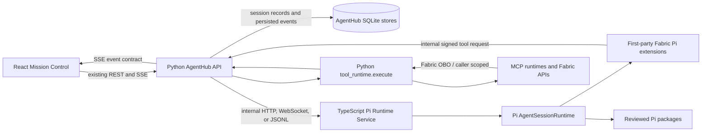
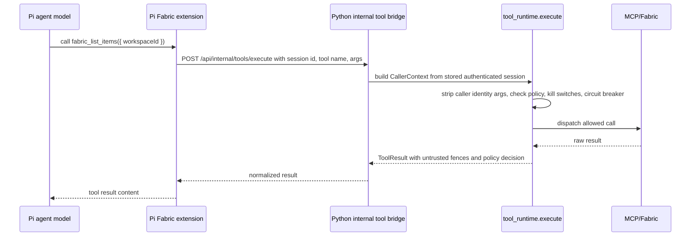

# Pi Mono as the Agent Runtime for Fabric Developer Hub

Status: architecture guidance, migration blueprint, full-page frontend Pi Web UI host, and Pi orchestration/extension-surface contract implemented
Scope: Developer Hub AgentHub, Mission Control, Fabric-oriented agent workflows
Primary recommendation: keep the Developer Hub workflow frontend and governance backend, make real Pi Web UI the Mission Control browser execution page, then move the agent loop/runtime layer toward Pi through a small TypeScript Pi runtime service, Fabric-specific Pi extensions, and a first-party Pi execution UI contract.

## Executive Recommendation

Developer Hub should use Pi as the agentic runtime layer, not as a replacement product shell.

The target shape is:

1. Keep the existing React Mission Control frontend for session workflow, workspace context, and non-execution product UI.
2. Keep the Python backend as the security, identity, audit, and public API control plane.
3. Use `@mariozechner/pi-web-ui` as the full Mission Control execution surface so the browser page is actually Pi-powered, not a cosmetic clone or a log wrapper.
4. Add a small TypeScript Pi runtime service that embeds `@mariozechner/pi-coding-agent` through the SDK.
5. Package Fabric capabilities as first-party Pi extensions and skills.
6. Create a first-party Pi Mission UI extension/contract so Pi-backed sessions render as a modern coding-agent execution surface, not just a better-looking log stream.
7. Bridge Pi session events and Pi extension UI requests into the existing AgentHub session/event/SSE contract.
8. Evaluate Pi community packages selectively, with strict source review and pinning.

The important framing is that Pi should own the coding-agent harness responsibilities we currently keep rebuilding: model abstraction, session lifecycle, streaming event production, tools, skills, prompt templates, commands, extensions, sub-sessions, compaction, and packageable agent behavior. Developer Hub should continue to own the product-specific responsibilities: Fabric identity, workspace scoping, tool authorization, UX, audit records, verifier policy, approvals, and the user-facing mission model.

This gives us the best of both worlds:

- Pi provides a popular, active, extensible coding-agent core.
- Developer Hub remains a Fabric-native product with its own trust boundaries and UI.
- Mission Control can evolve from log playback into a proper coding-agent transcript with tool cards, approvals, artifacts, streaming turns, and subagent activity.
- We avoid forking Pi and keep the migration reversible by putting a thin adapter between Pi and AgentHub.

## Non-Goals

This document does not propose replacing the full Developer Hub product with Pi's TUI. Pi's terminal UI is useful for local dogfooding and development, while the hosted product uses Pi's browser UI for the live execution page and keeps AgentHub for navigation, identity, audit, and governance.

This document does not propose running arbitrary Pi extension code inside the browser. The browser should embed a trusted Developer Hub renderer for structured Pi UI events. Pi extensions run in the runtime service; Mission Control receives declarative event payloads, artifacts, and interaction requests.

This document does not propose passing raw Fabric bearer tokens directly to arbitrary Pi extensions. Fabric access must continue to flow through backend-controlled policy and OBO boundaries.

This document does not propose installing random Pi packages into production by default. Pi packages can execute code and influence agent behavior, so every third-party package must be reviewed, pinned, and optionally sandboxed.

`context-mode@1.0.103` and `@a5c-ai/babysitter-pi@0.1.3` are now reviewed, pinned active Pi packages for the AgentHub runtime. They still run under AgentHub's existing container, MCP, approval, and audit boundaries rather than receiving unrestricted Fabric access.

This document does not propose a big-bang rewrite. The migration should be phased so the current AgentHub flow keeps working while Pi-backed sessions are introduced behind a feature flag.

## Source Material Reviewed

Local Pi source and docs:

- `../../pi-mono/README.md`
- `../../pi-mono/packages/coding-agent/README.md`
- `../../pi-mono/packages/coding-agent/docs/sdk.md`
- `../../pi-mono/packages/coding-agent/docs/rpc.md`
- `../../pi-mono/packages/coding-agent/docs/extensions.md`
- `../../pi-mono/packages/coding-agent/docs/packages.md`
- `../../pi-mono/packages/coding-agent/src/core/agent-session.ts`
- `../../pi-mono/packages/coding-agent/src/core/extensions/types.ts`
- `../../pi-mono/packages/coding-agent/src/index.ts`

Local Developer Hub source and architecture:

- `../Backend/src/api/agenthub_controller.py`
- `../Backend/src/services/agenthub/tool_runtime.py`
- `../Backend/src/services/agenthub/dynamic_orchestrator.py`
- `../Backend/src/services/agenthub/orchestrator_engine.py`
- `../Backend/src/services/agenthub/session_store.py`
- `../Backend/src/services/agenthub/session_event_store.py`
- `../Backend/src/services/agenthub/compose_service.py`
- `../Backend/src/services/agenthub/catalog.yaml`
- `../Frontend/src/controller/AgentHubApi.ts`
- `../Frontend/src/components/AgentHub/mission/MissionControlPage.tsx`

Pi package catalog highlights from `https://pi.dev/packages` and targeted package pages:

- `pi-messenger`
- `pi-subagents`
- `@tintinweb/pi-subagents`
- `pi-mcp-adapter`
- `context-mode`
- `@a5c-ai/babysitter-pi`
- `pi-btw`
- `@juicesharp/rpiv-btw`
- `pi-ask-user`
- `@juicesharp/rpiv-ask-user-question`
- `@juicesharp/rpiv-advisor`
- `@juicesharp/rpiv-todo`
- `@juicesharp/rpiv-pi`
- `pi-lens`
- `@marcfargas/pi-test-harness`
- `taskplane`
- `pi-crew`
- `pi-web-access`
- `@juicesharp/rpiv-web-tools`
- `pi-smart-fetch`
- `pi-docparser`
- `@walterra/pi-charts`
- `pi-studio`
- `@woxqaq/pi-web`
- `glimpseui`
- `@samfp/pi-memory`
- `@kaiserlich-dev/pi-session-search`
- `whatsapp-pi`

## What Pi Gives Us

The Pi monorepo is split into a few layers:

| Pi package | Role | Relevance to Developer Hub |
| --- | --- | --- |
| `@mariozechner/pi-ai` | Unified model/provider API | Useful if we want Pi to handle model provider differences instead of custom Copilot/OpenAI glue in the agent loop. |
| `@mariozechner/pi-agent-core` | Core LLM loop and tool calling | The base runtime for iterative agent behavior. |
| `@mariozechner/pi-coding-agent` | Full coding-agent runtime, CLI, sessions, tools, extensions, skills, prompts, package loader | The main integration target. |
| `@mariozechner/pi-tui` | Terminal UI toolkit | Useful for local developer/debug mode, not for product UI. |
| `@mariozechner/pi-web-ui` | Web components for AI chat, messages, tool rendering | Now embedded in Mission Control through `MissionPiRuntimeHost`, wrapped by the product-specific Pi Mission Surface. |

Pi's coding agent supports several run modes:

| Mode | How it works | Fit for us |
| --- | --- | --- |
| Interactive TUI | Human talks to Pi in a terminal | Useful for dogfooding and extension development. Not the product UI. |
| Print/JSON | One-shot or scriptable agent runs | Useful for test harnesses and batch jobs. |
| RPC | `pi --mode rpc` exposes JSONL commands/events over stdin/stdout | Useful for an early process-boundary spike or non-Node clients. |
| SDK | `createAgentSession()` and `createAgentSessionRuntime()` embed Pi directly in TypeScript | Best long-term integration point for Developer Hub. |

The SDK matters most because it lets us own the service boundary while using Pi's session/runtime internals. `createAgentSession()` creates an `AgentSession`; `createAgentSessionRuntime()` owns active-session replacement flows such as new session, switch session, fork, and import. `AgentSession` exposes the primitives we need for AgentHub:

- `prompt(text, options)`
- `steer(text)`
- `followUp(text)`
- `abort()`
- `subscribe(listener)`
- `setModel(model)`
- `cycleModel()`
- `compact()`
- `messages`
- `isStreaming`
- `sessionId`
- `sessionFile`
- `bindExtensions(...)`

The RPC mode is useful, but Pi's own docs recommend the SDK for TypeScript applications. RPC should be treated as a compatibility and isolation option, not the default architecture.

## Current Developer Hub Architecture

Developer Hub currently has a strong product architecture that should be preserved.

### Public Product Contract

The frontend talks to the backend through `AgentHubApi.ts`. The important public API surface includes:

- `POST /api/sessions`
- `GET /api/sessions`
- `GET /api/sessions/summary`
- `GET /api/sessions/{session_id}`
- `GET /api/sessions/{session_id}/status`
- `DELETE /api/sessions/{session_id}`
- `POST /api/sessions/{session_id}/message`
- `GET /api/sessions/{session_id}/events.json`
- `GET /api/sessions/{session_id}/events`
- `POST /api/sessions/{session_id}/run`
- `POST /api/sessions/{session_id}/approvals/{approval_id}`
- workspace and Fabric helper endpoints under `/api/workspaces/...`
- composition endpoints under `/api/orchestrate/...`

This is already shaped correctly for a browser product. The frontend should not need to know whether the session is backed by the current Python orchestrator, a container runner, a Pi SDK runtime, or a Pi RPC subprocess. That choice belongs behind the backend.

### Frontend Responsibilities

The frontend owns:

- Mission creation and workspace selection.
- Mission Control layout and execution transcript.
- Progress, current phase, agent lane, approvals, and verifier evidence rendering.
- User steering messages through `sendMessage(...)`.
- SSE subscription and replay through `subscribeToSessionEventsFetch(...)`.
- Design and usability of the Fabric product experience.

This is exactly where the product-specific user experience belongs. Pi should not replace this layer.

### Backend Responsibilities

The Python backend owns:

- Fabric token validation through `require_user(...)`.
- Stable user identity and session ownership.
- Workspace preview/context retrieval.
- Session CRUD and summaries.
- Event stream persistence and SSE replay.
- Composition and mission seeding.
- MCP/Fabric tool dispatch.
- Tool policy, sensitivity, deny-by-default behavior, kill switches, identity stripping, and circuit breakers in `tool_runtime.py`.
- Audit routes and debug snapshots.
- Existing live Fabric E2E/verifier flow.

The backend security model is a valuable asset. We should route Pi through it rather than bypass it.

### Current Orchestration Responsibilities

The current orchestration stack does several things that Pi can eventually absorb:

- Agent loop management.
- Tool call formatting and execution handoff.
- Dynamic specialist task creation.
- Parallel group spawning.
- Agent/subagent status events.
- Verifier feedback loops.
- Replanning and repair cycles.
- Streaming transcript/event generation.

But not all of those should move to Pi on day one. The migration should first bridge Pi's event stream into AgentHub, then move select loops once the bridge and security model are proven.

## Target Architecture

The target architecture is a three-layer product:

1. Mission Control UI: browser product surface.
2. AgentHub Python API: product control plane and security boundary.
3. Pi Runtime Service: agent loop and extension harness.



### Key Architectural Rule

Pi should be the engine, not the authority.

Pi can decide what tool it wants to call, what specialist it wants to spawn, how to use skills, and how to continue the agent loop. It should not decide who the user is, which tenant is authorized, whether a destructive Fabric action can proceed, or whether untrusted tool output should be treated as instructions.

Those remain backend decisions.

## Integration Options

### Option A: Pi RPC Subprocess

Run `pi --mode rpc` and communicate over JSONL stdin/stdout.

Pros:

- Fast to spike.
- Strong process boundary.
- Language-agnostic, so Python can talk directly to Pi without a Node service.
- Matches Pi's documented headless mode.
- Easy to kill and restart per mission.

Cons:

- More fragile protocol handling. JSONL framing must be exact.
- More work to bind custom UI behavior and extension state cleanly.
- Harder to expose rich runtime operations than the SDK.
- More process-management code in Python.
- Harder to test deeply than in-process SDK code.

Use this for: the first spike if we want proof within a day, or for high-isolation execution profiles.

Do not make this the long-term default unless the SDK service proves operationally awkward.

### Option B: TypeScript Pi Runtime Service Through SDK

Create a small service that imports `@mariozechner/pi-coding-agent`, creates an `AgentSessionRuntime`, subscribes to Pi events, and exposes an internal API to Python.

Pros:

- Uses Pi's preferred programmatic integration surface.
- Direct access to `AgentSession`, runtime replacement, extension binding, diagnostics, model control, and session state.
- Easier to build typed event mappers.
- Easier to implement a custom `ExtensionUIContext` that routes `select`, `confirm`, `input`, and notifications back to Mission Control.
- Better fit for packaging first-party Fabric extensions.
- Easier to unit test event mapping and custom tools.

Cons:

- Adds a Node/TypeScript service to a Python-centered backend.
- Requires service lifecycle, health checks, and deployment packaging.
- Requires a clean internal auth boundary between Python and Node.
- Requires careful session store ownership decisions.

Use this for: the recommended production architecture.

### Option C: Pi Web UI as the Mission Execution Page

Use `@mariozechner/pi-web-ui` as the Mission Control execution page while keeping the wider Developer Hub product shell, navigation, auth, and governance model.

Pros:

- Proves the frontend is using actual Pi browser runtime code and custom elements.
- Gives us Pi `ChatPanel`, `AgentInterface`, message storage, tool rendering, and artifact patterns immediately.
- Keeps the browser-side execution surface close to Pi's ecosystem while preserving the Fabric product frame.
- Provides concrete DOM and package metadata for Playwright proof.

Cons:

- It still needs AgentHub backing for Fabric approvals, verifier evidence, workspace context, and audit language.
- Pi Web UI brings browser bundling requirements such as KaTeX font assets and a `process` shim for provider discovery.
- Pi AI currently emits dynamic-import warnings that should be suppressed as known third-party warnings, not shown as a dev-server overlay.
- It does not replace the need for backend-native Pi runtime events.

Use this for: the current frontend milestone and future Pi-native Mission Control rendering.

Do not use this as a standalone generic chat replacement for Developer Hub. Mount it through the product-specific Pi Mission Surface and keep AgentHub/Fabric controls behind it.

### Option D: Fork Pi

Fork `pi-mono` and modify it directly for Fabric.

Pros:

- Maximum control.
- No adapter limitations.

Cons:

- We inherit a fast-moving agent harness as a maintenance burden.
- We lose easy upstream updates.
- We make community package compatibility harder.
- We duplicate exactly the ecosystem leverage we are trying to gain.

Use this for: only a last-resort patch if Pi lacks an extension point we truly need.

Do not choose this as the migration strategy.

## Recommended Architecture in Detail

### Runtime Service Placement

Create a new TypeScript service in the Developer Hub tree. Suggested location:

```text
Developer Hub/PiRuntime/
  package.json
  tsconfig.json
  src/
    index.ts
    server.ts
    runtimeManager.ts
    agentHubClient.ts
    eventMapper.ts
    fabricUiContext.ts
    sessions.ts
    config.ts
  packages/
    fabric-pi/
      package.json
      extensions/
        fabric-tools.ts
        agenthub-events.ts
        approvals.ts
      skills/
        fabric-workspace/SKILL.md
        fabric-report/SKILL.md
        fabric-semantic-model/SKILL.md
        fabric-verifier/SKILL.md
      prompts/
        mission-controller.md
        verifier.md
```

Alternative location if we want it more tightly bound to the Python backend:

```text
Developer Hub/Backend/src/services/pi_runtime/
```

The first option is cleaner because it makes the Node service explicit.

### Internal Service Contract

The Python backend should call the Pi runtime service over an internal-only channel. HTTP on localhost is easiest. Unix domain sockets are attractive later if we want stricter local process access.

Proposed internal endpoints:

| Endpoint | Purpose |
| --- | --- |
| `POST /internal/pi/sessions` | Create or attach a Pi session for an AgentHub session. |
| `POST /internal/pi/sessions/{id}/prompt` | Start the mission prompt. |
| `POST /internal/pi/sessions/{id}/steer` | Interrupt/steer the active agent turn. |
| `POST /internal/pi/sessions/{id}/follow-up` | Queue a follow-up message. |
| `POST /internal/pi/sessions/{id}/abort` | Abort the active operation. |
| `GET /internal/pi/sessions/{id}/state` | Return model, streaming state, queue depth, Pi session file, and diagnostics. |
| `GET /internal/pi/sessions/{id}/events` | Stream mapped Pi events to Python if Python is not using a callback/WebSocket push. |
| `DELETE /internal/pi/sessions/{id}` | Dispose runtime resources. |

The external frontend API remains unchanged.

### Internal Session Creation Payload

Python should create a normal AgentHub session first, then create a Pi runtime session linked to it.

```json
{
  "agentHubSessionId": "...",
  "workspaceId": "...",
  "userKey": "oid:...",
  "taskDescription": "...",
  "model": "github-copilot/gpt-4.1",
  "cwd": "/workspace/session-...",
  "allowedToolNames": [
    "fabric_list_items",
    "fabric_get_definition",
    "fabric_query_semantic_model",
    "fabric_verify_report_visual",
    "agenthub_request_approval"
  ],
  "metadata": {
    "requestId": "...",
    "tenantIdHash": "...",
    "workspaceDisplayName": "..."
  }
}
```

Do not put raw bearer tokens in this payload. The Pi runtime should receive an opaque mission credential for calling the Python internal tool bridge, or the bridge should accept only localhost requests signed with a service token and resolve the true caller from AgentHub session state.

### Pi Runtime Service Responsibilities

The TypeScript runtime service should own:

- Creating and disposing `AgentSessionRuntime` instances.
- Binding first-party Fabric Pi extensions.
- Optionally loading reviewed project-local Pi packages.
- Subscribing to Pi `AgentSessionEvent` events.
- Mapping Pi events to AgentHub event envelopes.
- Sending mapped events back to Python for persistence and SSE fanout.
- Translating Python `message` requests into Pi `prompt`, `steer`, or `followUp` calls.
- Implementing a custom `ExtensionUIContext` that routes Pi extension UI requests into AgentHub approval/clarification events.
- Enforcing runtime-level tool allowlists as defense in depth.
- Exporting health and diagnostics.

The service should not own:

- Fabric token validation.
- Session ownership decisions.
- Tool policy decisions.
- Audit persistence as the system of record.
- User-facing HTTP APIs.
- Product UI concerns.

### Python Backend Responsibilities After Adding Pi

The Python backend should continue to own:

- All existing public `/api/...` routes.
- `require_user(...)` and caller context derivation.
- Session ownership checks.
- Session/event persistence.
- SSE replay behavior.
- Tool policy through `tool_runtime.execute(...)`.
- MCP client manager and runtime/container boundaries.
- Approval records.
- Audit records.
- Feature flags for choosing Pi-backed vs legacy sessions.

### Why This Split Works

This split lets Pi do what it is already good at while keeping Developer Hub's strongest architecture intact.

Pi's extension system can register tools, commands, skills, UI interactions, lifecycle hooks, provider hooks, custom renderers, and resource discovery. The Python backend does not need to know those details. It only needs to receive normalized mission events and tool bridge requests.

Developer Hub already has an authenticated Fabric product shell and a strong `tool_runtime.py` policy boundary. Pi does not need to know how to validate Fabric JWTs or prevent caller identity smuggling. It can call a tool named `fabric_list_items`; Python decides what that actually means for the current user and workspace.

## Event Mapping

Pi emits rich session and agent events. AgentHub already has a mission event stream consumed by Mission Control. The migration should introduce a pure, tested event mapper.

Suggested file:

```text
Developer Hub/PiRuntime/src/eventMapper.ts
```

Suggested test file:

```text
Developer Hub/PiRuntime/tests/eventMapper.test.ts
```

### Mapping Principles

1. Preserve existing external event names when possible.
2. Add new fields rather than changing old fields.
3. Use AgentHub `sessionId` as the primary public identifier.
4. Treat Pi `sessionId` and Pi `sessionFile` as backend metadata.
5. Normalize all timestamps at the Python persistence boundary.
6. Persist raw Pi event details under a `pi` or `source` field for diagnostics, but keep the top-level event shape frontend-friendly.
7. Do not stream raw tool outputs directly to the UI until they are redacted and marked as untrusted where appropriate.

### Proposed Event Mapping Table

| Pi event | AgentHub event target | Notes |
| --- | --- | --- |
| `message_start` | `agent_message_started` or existing transcript start event | Include `agentId`, Pi message id, role, and lane. |
| `message_update` with text delta | `agent_message_delta` or transcript row update | Stream text deltas into Mission Control transcript. |
| `message_update` with tool/thinking deltas | `agent_message_delta` with subtype | Keep thoughts hidden or summarized according to current UX policy. |
| `message_end` | `agent_message_completed` | Close transcript row and persist full assistant message metadata. |
| `turn_start` | `agent_turn_started` | Useful for active lane and run intelligence. |
| `turn_end` | `agent_turn_completed` | Good point to update status, costs, token totals, and verifier cues. |
| `agent_start` | `agent_status` running | Mark lane active. |
| `agent_end` | `agent_status` idle/completed/failed | Include final error if present. |
| `tool_execution_start` | `tool_call_started` or `action_started` | Include normalized tool name and sensitivity. |
| `tool_execution_update` | `tool_call_update` or `action_log` | Use for progress, command output summaries, and current tool labels. |
| `tool_execution_end` | `tool_call_completed` or `action_completed` | Include policy decision, duration, output preview, and artifact refs. |
| `queue_update` | `steering_queue_update` | Powers queued steering/follow-up UI. |
| `compaction_start` | `run_intelligence` update | Tell UI context is being compacted, without making it feel like a failure. |
| `compaction_end` | `run_intelligence` update | Include reason, success, willRetry, and error preview. |
| `auto_retry_start` | `repair_started` or `issue_detected` | Surface as a controlled recovery action. |
| `auto_retry_end` | `repair_completed` or `issue_resolved` | Include final error only after redaction. |
| `session_info_changed` | `session_updated` | Update display name and metadata. |
| `thinking_level_changed` | `model_runtime_changed` | Persist as diagnostic metadata. |

### Mapping to Dynamic Mission Events

The current dynamic orchestrator emits mission-specific events such as:

- `mission_seeded`
- `task_created`
- `parallel_group_spawned`
- `subagent_steered`
- `subagent_cancelled`
- `subagent_heartbeat`
- `subagent_stale`
- `mission_replanned`
- `verifier_verdict`
- `mission_failed`
- `mission_blocked`
- `mission_cancelled`
- `mission_completed`
- `resource_lock_acquired`
- `resource_lock_released`
- `task_blocked`
- `task_failed`

Pi does not emit all of these natively. We should preserve them at the AgentHub layer where they express product workflow concepts.

Recommended approach:

- Pi event mapper emits generic agent/tool/message events.
- First-party Fabric extensions emit product mission events through an `agenthub_emit_event` helper only for semantic workflow milestones.
- Python validates and persists those product events.
- The frontend keeps reading the same Mission Control event stream.

Example: Pi `tool_execution_start` for `fabric_query_semantic_model` becomes `tool_call_started`. A Fabric verifier extension may later emit `verifier_verdict` after it has collected browser evidence and completed rubric evaluation.

## Tool and Security Model

The most important migration rule is this:

Every Fabric-impacting tool call must continue to go through `tool_runtime.execute(...)` or an equivalent backend-controlled policy boundary.

### Current Tool Runtime Guarantees to Preserve

`tool_runtime.py` currently provides:

- Caller context from verified Fabric JWT, not from LLM output.
- Stripping of user, tenant, UPN, and object id arguments supplied by the model.
- Per-tool policy registry.
- Deny-by-default behavior for unknown tools.
- Sensitivity classes for read-safe, read-sensitive, write, and destructive actions.
- Kill switches at global, per-tool, and per-tenant levels.
- Circuit breaker for repeated identical calls.
- Tool output wrapping in untrusted-content fences.
- Maximum tool output size.
- Idempotent replay handling for selected tools.

These are not generic agent-loop concerns. They are product security controls. Pi tools should call into them, not replace them.

### Recommended Tool Bridge

Create a first-party Pi extension that registers Fabric tools as Pi tools. Each tool implementation calls the Python backend internal tool endpoint.



### Internal Tool Request Shape

The Pi runtime should send only what Python needs to identify the session and requested tool.

```json
{
  "agentHubSessionId": "...",
  "piSessionId": "...",
  "toolCallId": "...",
  "toolName": "fabric_list_items",
  "arguments": {
    "workspaceId": "...",
    "itemType": "Report"
  },
  "agent": {
    "id": "generalist",
    "role": "mission-controller"
  }
}
```

Python should ignore any caller identity fields in `arguments`, just as it does today.

### Tool Result Shape Back to Pi

```json
{
  "ok": true,
  "toolName": "fabric_list_items",
  "policyDecision": "allowed",
  "latencyMs": 312,
  "output": "<<<UNTRUSTED_TOOL_OUTPUT_BEGIN>>>...<<<UNTRUSTED_TOOL_OUTPUT_END>>>",
  "artifacts": [],
  "display": {
    "summary": "Listed 18 Fabric items in workspace Contoso BI",
    "rows": 18
  }
}
```

The Pi extension should return the untrusted output to the model. Mission Control should render the `display` summary where useful, not the raw model-facing result.

### Tool Allowlist Strategy

Use two allowlists:

1. Pi runtime allowlist: only register tools relevant to the mission and current capability set.
2. Python tool runtime policy: still deny unknown, disabled, sensitive, or confirmation-required tools.

The Pi allowlist reduces model confusion and prompt attack surface. The Python policy boundary remains the true enforcement point.

### Write and Destructive Operations

For write/destructive tools:

- Pi tool calls should return `confirm_required` from Python when no confirmation token is present.
- Python should emit an AgentHub approval event.
- Mission Control should display the approval in the existing approval UI.
- The user decision should create a backend confirmation token scoped to `sessionId`, `toolName`, `argHash`, `workspaceId`, and expiration.
- The Pi runtime can retry the same tool call with the confirmation token only after Python has recorded approval.

Do not implement write approvals only inside Pi extension UI. The approval needs to be auditable in AgentHub and visible in Mission Control.

## First-Party Fabric Pi Package

We should create a first-party project-local Pi package rather than scattering ad hoc tools into the runtime service.

Suggested package name:

```text
@fabric-clawhub/pi-fabric
```

Suggested package manifest:

```json
{
  "name": "@fabric-clawhub/pi-fabric",
  "version": "0.1.0",
  "private": true,
  "keywords": ["pi-package"],
  "peerDependencies": {
    "@mariozechner/pi-ai": "*",
    "@mariozechner/pi-agent-core": "*",
    "@mariozechner/pi-coding-agent": "*",
    "@mariozechner/pi-tui": "*",
    "typebox": "*"
  },
  "pi": {
    "extensions": ["./extensions"],
    "skills": ["./skills"],
    "prompts": ["./prompts"]
  }
}
```

### Extension Modules

| Module | Responsibility |
| --- | --- |
| `fabric-tools.ts` | Register Fabric read/write tools that call Python `tool_runtime`. |
| `agenthub-events.ts` | Helper for emitting semantic AgentHub mission events from Pi. |
| `mission-ui.ts` | Emit frontend-renderable Pi Mission UI events for turns, tool cards, artifacts, approvals, retries, and subagent activity. |
| `approvals.ts` | Convert Pi UI confirmation requests into backend approval events. |
| `fabric-context.ts` | Inject compact workspace context and item inventory into session start/context events. |
| `verifier.ts` | Register verifier-oriented tools and emit verifier verdict events. |
| `guardrails.ts` | Block direct file/system actions when they would violate mission scope. |

This package should be paired with a frontend renderer package or module under Mission Control. The runtime extension owns semantics and event emission. The frontend renderer owns visual layout, accessibility, keyboard behavior, design-system integration, and evidence collection for E2E tests.

### Initial Tool Set

Start with read-only tools:

| Tool | Sensitivity | Purpose |
| --- | --- | --- |
| `fabric_list_workspaces` | read-safe | Discover available workspaces if the backend permits it. |
| `fabric_get_workspace_context` | read-safe | Return the selected workspace summary and item inventory. |
| `fabric_list_items` | read-safe | List Fabric items in the selected workspace. |
| `fabric_get_item_definition` | read-sensitive | Fetch item definitions for reports, notebooks, semantic models, and pipelines. |
| `fabric_query_semantic_model` | read-sensitive | Execute a read-only DAX query through backend policy. |
| `fabric_get_report_assets` | read-sensitive | Fetch report visual/layout metadata for verifier work. |
| `fabric_capture_browser_evidence` | read-sensitive | Ask backend/browser verifier to capture report/UI evidence. |
| `fabric_verify_deliverable` | read-sensitive | Run deterministic and LLM verifier checks. |
| `agenthub_emit_progress` | read-safe/internal | Emit user-visible progress milestones. |
| `agenthub_request_clarification` | read-safe/internal | Request a user decision through Mission Control. |

Add write tools later:

| Tool | Sensitivity | Gate |
| --- | --- | --- |
| `fabric_create_item` | write | Requires backend approval token unless explicitly auto-approved by policy. |
| `fabric_update_item_definition` | write | Requires approval and diff preview. |
| `fabric_run_notebook` | write | Requires approval when it can mutate data. |
| `fabric_trigger_pipeline` | write | Requires approval and workspace/run scope. |
| `fabric_delete_item` | destructive | Probably not agent-autonomous in early versions. |

### Skill Set

First-party skills should encode Fabric-specific operating knowledge. Suggested skills:

| Skill | Purpose |
| --- | --- |
| `fabric-workspace` | Workspace navigation, item types, and safe discovery patterns. |
| `fabric-report` | PBIR/report definition inspection and visual verification patterns. |
| `fabric-semantic-model` | Semantic model metadata, DAX query safety, measure inspection. |
| `fabric-notebook` | Notebook definition reading, Spark/Fabric conventions, validation rules. |
| `fabric-pipeline` | Pipeline/deployment flow inspection and dependency reasoning. |
| `fabric-verifier` | Evidence requirements, deterministic rubric, LLM judge usage, browser proof expectations. |
| `agenthub-mission-control` | How Pi should emit progress events and when to ask the user. |

Skills should be concise and loaded on demand. We do not want every Fabric detail in the base system prompt.

## Mission Control as a Pi UI Host

The user asked whether our frontend chat should expose a UI extension we write for Pi. The answer is yes, and it should be treated as a first-class migration deliverable.

The current Mission Control execution surface still starts from public log entries and transforms them into transcript rows. That is much better than raw logs, but it still behaves like execution logging. A modern coding-agent UI should feel closer to Claude Code, Copilot Chat agent mode, and Pi's own web UI ideas: streaming assistant turns, structured tool cards, durable artifacts, inline approvals, replayable state, and clear pause/retry/compaction markers.

The migration should therefore include a Pi Mission UI layer. This is not a third-party browser plugin and it is not a skin over old logs. The live execution page now follows the `pi-remote-web-ui` pattern more closely: the browser surface is the Pi Web UI, backed by shared AgentHub session state, while AgentHub remains responsible for Fabric auth, tenant isolation, audit, and tool policy.

### Target Layered Pi Architecture

The target AgentHub architecture now follows Pi's three-layer model rather than a flat package checklist:

| Pi layer | AgentHub implementation | Packages and runtime proof |
| --- | --- | --- |
| Application layer | Mission Control, New Session, the full-page Pi Web UI browser host, the local Fabric ClawHub Mission UI extension, user prompts, and subagent-visible work surfaces. | `@mariozechner/pi-coding-agent`, `@mariozechner/pi-web-ui`, `pi-ask-user`, `pi-subagents`, and `@fabric-clawhub/pi-mission-ui`; proven with `data-pi-application-layer` and extension metadata. |
| Core layer | The Pi agent loop/harness boundary plus the backend AgentHub bridge that enriches sessions, emits `pi.orchestration.start`, projects governed tools, and replays typed Pi events. | `@mariozechner/pi-agent-core`; proven with `data-pi-core-layer`, `data-pi-orchestration-package`, `data-pi-orchestration-harness`, and nonzero backend tool counts. |
| Foundation layer | Model/provider streaming, terminal rendering, MCP/tool bridging, AgentHub Fabric tool policy enforcement, SSE/event-store replay, and raw trace diagnostics. | `@mariozechner/pi-ai`, `@mariozechner/pi-tui`, and `pi-mcp-adapter`; proven with `data-pi-foundation-layer`, `data-pi-ai-package`, `data-pi-tui-package`, and `data-pi-mcp-adapter-package`. |

This is intentionally close to Pi's `pi-coding-agent` / `pi-web-ui` application layer over `pi-agent-core`, with `pi-ai` and `pi-tui` as foundations. AgentHub still owns Fabric authorization, tenant/session isolation, audit, and tool policy. Today the backend is a Pi-compatible harness over AgentHub's Python orchestration engine, not a separate Node-native Pi runtime service. The migration path should preserve this layered boundary while moving more runtime execution behind the `pi-agent-core` bridge when the backend service is ready.

### Implemented Frontend Milestone

Mission Control now uses actual Pi packages in the frontend:

| Implemented piece | Location | What it proves |
| --- | --- | --- |
| Real Pi Web UI host | `Frontend/src/components/AgentHub/mission/pi/MissionPiRuntimeHost.tsx` | Mounts `@mariozechner/pi-web-ui` `ChatPanel`, `AgentInterface`, and `message-editor` custom elements as the live execution UI. The host uses a custom Pi `streamFn` so Pi editor sends are queued through AgentHub instead of requiring browser-held provider keys. |
| Product Pi extension surface | `Frontend/src/components/AgentHub/mission/pi/MissionPiSurface.tsx` | Provides the Pi proof and event contract attributes, then gives the full page to the native Pi Web UI for runtime transcript and message input. It declares `data-pi-extension-surface="@fabric-clawhub/pi-mission-ui"` and `data-pi-stream-interface="pi-web-ui-agent-interface"`. |
| Local Pi log compactor extension | `.pi/extensions/fabric-clawhub-log-compactor.ts` and `Frontend/src/components/AgentHub/mission/pi/piLogCompactionExtension.ts` | Registers `@fabric-clawhub/pi-log-compactor` and applies a presentation-only self-collapsing policy: current rows stay expanded, older contiguous activity becomes native `<details>` rollups with hidden replay details. |
| Pi orchestration event contract | `Frontend/src/components/AgentHub/mission/events.ts` and `Frontend/src/components/AgentHub/mission/pi/piMissionReducer.ts` | Adds `pi.orchestration.start` so Mission Control can prove the runtime package, frontend package, extension surface, and stream transport. |
| Legacy-to-Pi adapter | `Frontend/src/components/AgentHub/mission/pi/piMissionAdapter.ts` | Converts current AgentHub mission telemetry into typed `pi.*` events and injects a synthetic `pi.orchestration.start` when older backend streams do not yet emit one. |
| Pi session creation contract | `Frontend/src/components/AgentHub/OrchestratorPage.tsx` | Keeps New Session step 1 visually unchanged while sending `runtime: "pi"`, `orchestration_runtime: "pi"`, `execution_stream_interface: "pi-extension"`, and the Pi extension package list in session context. |
| Backend Pi startup bridge | `Backend/src/services/agenthub/orchestrator_engine.py` | Emits `pi.orchestration.start` at runtime startup for sessions created with the Pi context contract. |
| Backend Pi harness | `Backend/src/services/agenthub/pi_backend_harness.py`, `Backend/src/api/agenthub_controller.py`, `Backend/src/services/agenthub/orchestrator_engine.py` | Backend-created sessions default to `runtime=pi` / `orchestration_runtime=pi`, and startup emits `orchestrationHarness=pi-agent-core`, `toolRegistry=agenthub-tool-runtime`, `toolExecutionBridge=agenthub-tool-runtime-proxy`, `toolCount > 0`, policy summaries, and Pi-compatible tool descriptors projected from AgentHub tool policies. |
| Pi package registry | `Frontend/src/components/AgentHub/mission/pi/piExtensionPackages.ts` | Pins and exposes `@mariozechner/pi-web-ui@0.71.1`, `@mariozechner/pi-ai@0.71.1`, `@mariozechner/pi-agent-core@0.71.1`, `@mariozechner/pi-coding-agent@0.71.1`, `@mariozechner/pi-tui@0.71.1`, `pi-ask-user@0.8.0`, `pi-subagents@0.21.3`, `pi-mcp-adapter@2.5.2`, `context-mode@1.0.103`, `@a5c-ai/babysitter-pi@0.1.3`, the local Mission UI extension identity, and `@fabric-clawhub/pi-log-compactor`, then exports the `application -> core -> foundation` architecture contract. |
| Project Pi config | `.pi/settings.json`, `.pi/mcp.json`, `.pi/extensions/fabric-clawhub-mission-ui.ts`, and `.pi/extensions/fabric-clawhub-log-compactor.ts` | Declares real Pi packages, registers the `context-mode` MCP server with a pinned `npx context-mode@1.0.103` command, and provides local Pi extensions for Mission UI event publication plus self-collapsing live-log rollups. |
| Webpack browser support | `Frontend/tools/webpack.config.js` | Resolves Pi Web UI KaTeX fonts, provides the browser `process` shim, and suppresses known Pi AI dynamic-import warnings so the dev overlay does not block the app. |

Playwright now asserts the concrete Pi runtime and orchestration evidence: `pi-chat-panel[data-pi-web-component="pi-chat-panel"]`, `agent-interface[data-pi-runtime="@mariozechner/pi-web-ui"]`, visible `message-editor textarea`, absence of the old Mission Control execution shell/right rail, `data-pi-runtime-package="@mariozechner/pi-web-ui"`, `data-pi-architecture-layers="application->core->foundation"`, `data-pi-application-layer`, `data-pi-core-layer="@mariozechner/pi-agent-core"`, `data-pi-foundation-layer`, `data-pi-ai-package="@mariozechner/pi-ai"`, `data-pi-cli-package="@mariozechner/pi-coding-agent"`, `data-pi-tui-package="@mariozechner/pi-tui"`, `data-pi-mcp-adapter-package="pi-mcp-adapter"`, `data-pi-context-mode-status="active"`, `data-pi-babysitter-status="active"`, `data-pi-log-compaction-status="active"`, `data-pi-orchestration-package="@mariozechner/pi-agent-core"`, `data-pi-orchestration-harness="pi-agent-core"`, `data-pi-backend-tool-count` greater than zero, `data-pi-tool-registry="agenthub-tool-runtime"`, `data-pi-extension-surface="@fabric-clawhub/pi-mission-ui"`, `data-pi-execution-stream="typed-pi-events"`, `data-pi-stream-interface="pi-web-ui-agent-interface"`, and extension package metadata containing `npm:@mariozechner/pi-ai@0.71.1`, `npm:pi-ask-user@0.8.0`, `npm:pi-subagents@0.21.3`, `npm:pi-mcp-adapter@2.5.2`, `npm:context-mode@1.0.103`, `npm:@a5c-ai/babysitter-pi@0.1.3`, `.pi/extensions/fabric-clawhub-log-compactor.ts`, and `npm:@mariozechner/pi-agent-core@0.71.1`.

### Recommendation: First-Party Pi Mission UI Extension

Create two related pieces:

| Piece | Runs where | Responsibility |
| --- | --- | --- |
| Runtime extension, for example `@fabric-clawhub/pi-mission-ui` | TypeScript Pi runtime service | Register helpers for emitting structured UI events, custom messages, status updates, approval prompts, artifacts, verifier summaries, and subagent activity. |
| Frontend renderer, for example `MissionPiSurface` | Developer Hub React frontend | Render those structured events as a modern coding-agent execution surface inside Mission Control. |

The runtime extension should run with Pi, alongside `@fabric-clawhub/pi-fabric`. The frontend should only receive declarative JSON and artifact references through AgentHub events. This keeps the browser safe, keeps Fabric credentials out of the client, and gives us full product control over the UX.

The renderer now mounts `@mariozechner/pi-web-ui` directly as the primary execution page and should continue using these Pi primitives:

- `ChatPanel` and `AgentInterface` for streaming message behavior.
- Custom message renderers for product-specific message types.
- Artifact panel patterns for HTML, SVG, Markdown, JSON, image, and document previews.
- Tool execution cards and attachment affordances.

The user-facing product should still keep Fabric workspace context, approvals, verifier evidence, audit semantics, and AgentHub governance outside the browser-held model loop. The current UI approach is therefore Pi-first on the execution page: native Pi Web UI owns the transcript/editor surface, while React provides the session shell and proof attributes and AgentHub owns secure backend state.

### Why the Current Log Surface Is Not Enough

Today the frontend path is roughly:

```text
AgentHub event store -> Mission reducer logs -> buildExecutionTranscriptRows(...) -> canvas-log-stream rows
```

That is useful for continuity, but it flattens the agent experience. Assistant thoughts, tool calls, approvals, verifier verdicts, artifacts, subagent work, retries, and steering messages all compete as rows in the same stream. The result can be understandable but still feels like a decorated log viewer.

The Pi-backed UI should render dedicated primitives:

| Primitive | What the user sees | Why it matters |
| --- | --- | --- |
| Assistant turn | Streaming answer with stable author, model, and turn state | Feels like an agent conversation, not a log line. |
| Tool card | Tool name, purpose, arguments summary, status, duration, result summary, expandable details | Makes actions inspectable without flooding the screen. |
| Fabric artifact card | Report, semantic model, notebook, pipeline, diff, screenshot, verifier evidence, or download link | Connects execution to concrete Fabric output. |
| Approval card | Inline confirm/reject controls with diff/risk preview and scoped action metadata | Keeps write operations auditable and understandable. |
| Clarification card | Inline question with input/select controls | Maps Pi `ask user` behavior to product UI. |
| Subagent presence | Lane/pill/timeline showing planner, specialist, verifier, reviewer, or side conversation | Makes multi-agent work legible. |
| Retry/failure card | Error, retry attempt, fallback model, or blocked policy explanation | Avoids silent churn and hidden failures. |
| Compaction marker | Compact context event with a short explanation and preserved mission state | Explains context management without turning it into noise. |
| Raw trace drawer | Optional diagnostic drawer for raw AgentHub/Pi event payloads | Keeps power-user debugging available without making it the main UI. |

### Pi Extension UI Context Bridge

Pi extensions can call UI primitives such as:

- `select(...)`
- `confirm(...)`
- `input(...)`
- `notify(...)`
- `setStatus(...)`
- `setWidget(...)`
- `custom(...)`
- `editor(...)`
- `setWorkingMessage(...)`

In the SDK, `AgentSession.bindExtensions(...)` accepts an `ExtensionUIContext`. We can implement a custom `ExtensionUIContext` in the Pi runtime service that does not render terminal dialogs. Instead, it emits structured events to Python, which persists them and streams them to Mission Control.

Example mapping:

| Pi extension UI request | Mission Control behavior |
| --- | --- |
| `ui.confirm(title, message)` | Create an approval card and wait for user decision. |
| `ui.select(title, options)` | Create a decision panel with single-select options. |
| `ui.input(title, placeholder)` | Create a clarification prompt in the chat/input rail. |
| `ui.notify(message, warning)` | Add a run-intelligence signal or transcript system row. |
| `ui.setStatus(key, text)` | Update active lane/status chips. |
| `ui.setWorkingMessage(message)` | Update the live execution status line. |

This lets Pi extensions behave as if they have UI affordances while preserving the Developer Hub frontend. The key is that each request has a stable `requestId`, `sessionId`, `turnId`, and optional `toolCallId` so Python can persist it and Mission Control can respond exactly once.

### Pi Mission UI Event Contract

The runtime service should normalize Pi lifecycle events and extension UI requests into a product event schema before sending them to Python. The exact shape can evolve, but it should be typed and versioned from the beginning.

Example sketch:

```ts
type AgentHubPiUiEvent =
  | { schemaVersion: 1; type: "pi.turn.start"; turnId: string; agentId: string; model?: string }
  | { schemaVersion: 1; type: "pi.turn.delta"; turnId: string; textDelta: string }
  | { schemaVersion: 1; type: "pi.turn.end"; turnId: string; status: "completed" | "aborted" | "failed" }
  | { schemaVersion: 1; type: "pi.tool.start"; toolCallId: string; turnId: string; toolName: string; summary: string }
  | { schemaVersion: 1; type: "pi.tool.end"; toolCallId: string; status: "ok" | "error" | "confirm_required"; display: ToolDisplaySummary }
  | { schemaVersion: 1; type: "pi.artifact.upsert"; artifactId: string; kind: "diff" | "screenshot" | "report" | "markdown" | "json"; title: string }
  | { schemaVersion: 1; type: "pi.approval.request"; requestId: string; toolCallId?: string; title: string; risk: "low" | "medium" | "high" }
  | { schemaVersion: 1; type: "pi.clarification.request"; requestId: string; control: "input" | "select" | "multiSelect" }
  | { schemaVersion: 1; type: "pi.subagent.update"; agentId: string; role: string; state: "queued" | "running" | "blocked" | "done" | "failed" }
  | { schemaVersion: 1; type: "pi.context.compaction"; status: "started" | "completed"; summary?: string }
  | { schemaVersion: 1; type: "pi.retry"; status: "started" | "completed"; reason?: string };
```

Rules for the contract:

- It must be append-only and replayable from `events.json`.
- It must be renderable without a live Pi process.
- It must distinguish model-facing content from user-facing summaries.
- It must carry correlation ids for session, turn, tool call, approval, artifact, and subagent.
- It must include redaction/trust metadata when content comes from tools, files, Fabric definitions, or model output.
- It must not require the frontend to understand raw Pi internals.

### Rendering Strategy in Mission Control

Mission Control should replace the old execution shell with a full-page Pi Mission Surface when `session.runtime === "pi"` or when Pi UI events are present.

Recommended layout:

| Region | Pi-backed behavior |
| --- | --- |
| Main execution surface | Conversational turns interleaved with tool cards, approval cards, artifacts, verifier cards, retry cards, and compaction markers. |
| Agent lanes | Driven by `pi.subagent.update`, Pi queue events, and AgentHub composition data. |
| Right rail / Mission intelligence | Summary of current objective, last material result, active blocker, verifier status, outputs, and change evidence. |
| Composer | Sends steering/follow-up through existing `sendMessage`, then Pi runtime maps it to `steer` or `followUp` based on session state. |
| Diagnostics drawer | Raw Pi/AgentHub event trace, hidden by default, for engineering support and E2E evidence capture. |

The old `buildExecutionTranscriptRows(...)` path should remain as a fallback for legacy sessions and for Pi events that have not yet been mapped. It should not be the main long-term UX for Pi-backed sessions.

### Suggested File Shape

```text
Developer Hub/PiRuntime/packages/pi-mission-ui/
  package.json
  extensions/mission-ui.ts
  src/eventSchema.ts
  src/uiContextBridge.ts
  src/artifactEvents.ts
  tests/eventSchema.test.ts

Developer Hub/Frontend/src/components/AgentHub/mission/pi/
  MissionPiSurface.tsx
  PiAssistantTurn.tsx
  PiToolCard.tsx
  PiArtifactCard.tsx
  PiApprovalCard.tsx
  PiSubagentTimeline.tsx
  piMissionReducer.ts
  piMissionEvidence.ts
```

The runtime package and frontend module should share a generated or manually synchronized TypeScript schema. If keeping a single source of truth is practical, define the schema in the Pi runtime package and consume it from the frontend workspace through a local package reference.

### Product Acceptance Bar

The Pi Mission Surface should pass these product checks before it replaces the current execution stream:

- A user can tell what the agent is doing without opening raw logs.
- Tool calls are inspectable as cards, with arguments summarized and outputs redacted/summarized by default.
- Approvals and clarifications are inline, auditable, and connected to the exact tool/action that requested them.
- Streaming text updates in place, without adding a wall of tiny rows.
- Subagents and side conversations are visible as lanes or scoped activity groups.
- Artifacts and verifier evidence are first-class, not buried in log text.
- The raw event trace exists but is not the primary reading experience.
- The strict Designer/UIUX judge can verify that it feels like a modern coding-agent workbench, not a debug console.

## Pi Package Catalog Recommendations

Pi's package catalog is a major reason to build on Pi, but packages need tiers.

### Tier 1: Strong Candidates for Early Evaluation

| Package | What it does | Why it is useful | Adoption stance |
| --- | --- | --- | --- |
| `pi-mcp-adapter` | MCP adapter extension for Pi | We already have MCP-oriented Fabric tools, and this gives Pi one small proxy tool with lazy server startup instead of dumping many MCP tool schemas into context. | Adopt as an active Pi package, but keep MCP calls behind AgentHub policy and keep direct tools disabled unless explicitly allowlisted. |
| `pi-messenger` | Inter-agent messaging, presence, file reservations, crew task orchestration | Very relevant to our dynamic specialist work. It includes file reservations, activity feeds, planner/work/reviewer waves, and agent-to-agent steering. | Great for experiments and possible future parallel-agent layer. Do not make it the first production dependency. |
| `pi-subagents` | Delegation to subagents with chains, parallel execution, and TUI clarification | Aligns with our current dynamic specialist direction. | Evaluate for replacing or informing our specialist spawning loop. |
| `@tintinweb/pi-subagents` | Claude Code-style autonomous subagents | Similar value to `pi-subagents`, potentially different ergonomics. | Compare against `pi-subagents` in a spike. |
| `pi-btw` | Parallel side conversations with `/btw` | Useful for quick design/review questions during a mission without polluting main context. | Adopt for developer dogfooding; productize later as hidden side-review primitive. |
| `@juicesharp/rpiv-btw` | Side-question slash command using primary model | Similar to `pi-btw`, with simple mental model. | Evaluate alongside `pi-btw`. |
| `pi-ask-user` | Interactive ask-user tool with searchable split-pane selection | Maps directly to our clarification/approval UI needs. | Evaluate, but route UI through Mission Control. |
| `@juicesharp/rpiv-ask-user-question` | Structured clarifying question extension | Similar value with focused scope. | Evaluate for UX event model ideas. |
| `@juicesharp/rpiv-advisor` | Ask a stronger reviewer model for a second opinion | Strong match for our Designer/UIUX and verifier judge patterns. | Good candidate for verifier/reviewer loops after cost controls. |
| `@marcfargas/pi-test-harness` | Test harness for Pi extensions | Directly useful for first-party Fabric extension testing. | Adopt early if source review passes. |
| `pi-lens` | LSP, lint, formatter, type-checking, structural feedback | Useful for coding-agent validation loops. | Evaluate for local coding tasks, less central for Fabric runtime. |
| `context-mode` | Sandboxed search, FTS5 knowledge base, context saving | Useful for long mission context, documentation search, and compaction continuity, but it can execute code and is licensed Elastic-2.0. | Active and pinned. Its MCP server is registered in `.pi/mcp.json` and must run inside the same mission container and storage boundaries as other AgentHub-governed tools. |
| `@a5c-ai/babysitter-pi` | Thin Pi extension and skill package for Babysitter process-as-code workflows | Strong fit for quality gates, breakpoints, journaling, resume/doctor flows, and deterministic process discipline. It also overlaps the AgentHub orchestrator and can install/run broader Babysitter SDK workflows. | Active and pinned. Babysitter remains a Pi process/governance package while AgentHub keeps authority over Fabric writes, approvals, container limits, and audit. |
| `@juicesharp/rpiv-todo` | Todo overlay that survives reload and compaction | Our Mission Control already has progress concepts; useful as a model for Pi-side task persistence. | Dogfood, but do not duplicate product task UI. |

### Tier 2: Useful Later, Requires Careful Product Fit

| Package | What it does | Possible use | Adoption stance |
| --- | --- | --- | --- |
| `taskplane` | Parallel task execution with checkpoint discipline | Could inform mission planning and parallel workers. | Evaluate after Pi session bridge works. |
| `pi-crew` | Coordinated AI teams, workflows, worktrees, async orchestration | Similar to our multi-agent mission model. | Interesting but overlaps heavily with AgentHub. Evaluate cautiously. |
| `@juicesharp/rpiv-pi` | Skill-based workflow: discover, research, design, plan, implement, validate | Strong development workflow package. | Good for extension development, less likely as production mission controller. |
| `@samfp/pi-memory` | Persistent memory for Pi sessions | Could improve repeated agent behavior. | Needs privacy and tenant isolation review. |
| `@kaiserlich-dev/pi-session-search` | FTS search across Pi sessions | Useful for developer history search and diagnostics. | Evaluate only after session ownership model is final. |
| `pi-web-access` | Web search/fetch, GitHub clone, PDF/video analysis | Useful for research tasks. | Keep out of Fabric production by default unless the mission type needs web access. |
| `@juicesharp/rpiv-web-tools` | Brave-backed web search/read | Same as above with a narrower API. | Requires API key and data governance review. |
| `pi-smart-fetch` | Smart web fetch with TLS impersonation and extraction | Useful for difficult docs retrieval. | Avoid by default in production due to governance and behavior surface. |
| `pi-docparser` | Parse PDFs, Office documents, spreadsheets, images | Useful for attachment-heavy Fabric tasks. | Evaluate if attachments become central. |
| `@walterra/pi-charts` | Vega-Lite charts inline | Could help explain analytics results. | Product UI should render charts itself if user-facing. |
| `pi-oracle` | Isolated browser-auth web oracle | Could support external review/oracle use cases. | Keep out of core; governance risk. |

### Tier 3: UI and Shell Inspiration, Not Core Runtime

| Package | What it does | Recommendation |
| --- | --- | --- |
| `pi-studio` | Browser workspace for Pi with prompt/response editing and previews | Study for internal tooling, not the product frontend. |
| `@woxqaq/pi-web` | Web shell for Pi coding agent | Study for developer console ideas. |
| `glimpseui` | Native micro-UI for scripts and agents | Useful for local tools, not Mission Control. |
| `pi-markdown-preview` | Rendered markdown and LaTeX preview | Useful locally; product should render its own artifacts. |
| `pi-mermaid` | Mermaid rendering in TUI | Useful locally; product already can render diagrams if needed. |

### Tier 4: Probably Not Core for Fabric Developer Hub

| Package | Why not core |
| --- | --- |
| `whatsapp-pi` | Messaging integration is not central unless product direction includes external chat-channel collaboration. |
| `@feniix/pi-notion` | Notion is not part of the Fabric workflow core. |
| `pi-zotero` | Research/citation tooling is outside the main product. |
| `@ollama/pi-web-search` | Useful for local web search, but not a Fabric-specific runtime need. |

## Special Note on `pi-messenger`

`pi-messenger` is more relevant than the name first suggests. It is not just chat. Its package page describes:

- Inter-agent messaging.
- Agent presence and status.
- Activity feed.
- File reservations.
- Stuck detection.
- Human as a participant.
- A chat overlay.
- Crew task orchestration from PRD or prompt.
- Planner, worker, reviewer roles.
- Parallel waves with dependency graphs.
- Crew skills loaded on demand.
- Project-scoped logs under `.pi/messenger/crew/`.
- Shared state in files rather than a daemon.
- Tool hooks that can block write/edit operations when files are reserved.

This overlaps with several things AgentHub currently implements or wants:

- Dynamic specialist orchestration.
- Resource locks.
- Activity feed.
- Worker coordination.
- Reviewer loops.
- Stuck detection.
- Steering prompts.
- Human intervention.

Recommendation:

1. Use `pi-messenger` as a design reference immediately.
2. Run it in a local dogfood workspace to understand the ergonomics.
3. Do not adopt it as the production mission orchestrator until the Pi runtime bridge is stable.
4. If adopted, wrap it behind the same AgentHub event and approval contracts.
5. Treat its file-based shared state as an implementation detail, not the Developer Hub system of record.

The likely product path is not "install pi-messenger and replace AgentHub." It is "learn from pi-messenger's coordination model, then decide whether to use it behind our runtime service for parallel worker missions."

## Should We Use Pi Itself to Build the Extension?

Yes, but as a development assistant and dogfooding loop, not as an unreviewed production author.

Pi is itself a coding agent harness with extension-building support. It can help us:

- Scaffold the first-party Fabric Pi package.
- Generate TypeBox schemas for tools.
- Convert existing AgentHub capability catalog entries into Pi skills.
- Write event mapper tests.
- Explore third-party packages.
- Run local dogfood sessions against a fixture workspace.
- Iterate on prompts and skills.
- Build documentation from implementation examples.

But we should still build and own the extension ourselves because:

- Fabric token handling is security-sensitive.
- Tool policies need deliberate review.
- Mission Control event semantics are our product contract.
- Generated code can accidentally bypass existing safeguards.
- We need predictable tests and reviewable diffs.

Recommended policy:

- Use Pi to draft and refactor extension code.
- Require human/code-review gates for tool schemas, backend bridge calls, and permission logic.
- Require unit tests for every tool wrapper and event mapper.
- Require live or fixture E2E before enabling a tool in production.
- Keep the first-party Fabric package in this repo, versioned with Developer Hub.

## Session Persistence Strategy

Pi has its own session JSONL format under the Pi agent directory. AgentHub has its own session and event stores. We should not choose one immediately as the only source of truth.

Recommended phase 1 persistence model:

- AgentHub remains the product system of record.
- Pi session files are diagnostic runtime artifacts.
- Store Pi `sessionId`, `sessionFile`, runtime version, package list, and model info in AgentHub session metadata.
- Persist normalized events in `session_event_store.py` as today.
- Optionally store raw Pi event snapshots for debugging with size caps.

Later, we can choose whether Pi JSONL becomes the canonical transcript source. That should wait until Mission Control can reconstruct every required UI state from Pi sessions plus AgentHub metadata.

## Model Provider Strategy

Pi supports multiple providers and model registry/auth storage. Developer Hub currently has GitHub/Copilot and Fabric-oriented auth concerns.

Recommendation:

- Let Pi own model invocation for Pi-backed sessions.
- Keep the existing model-selection UX and compose-model ranking initially.
- Add a backend-to-Pi model mapping layer so frontend model IDs do not leak Pi internals.
- Use Pi's `ModelRegistry` and `AuthStorage` inside the runtime service.
- For GitHub Copilot provider integration, prefer Pi's provider support if it is compatible with our auth flow. If not, add a first-party provider bridge only inside the runtime service.
- Keep cost/token reporting normalized back into AgentHub.

Important requirement:

- If the model provider credential belongs to the user, do not store it in Pi global config unless we have a clear tenant/user isolation model.

## Runtime Service Sketch

This is intentionally illustrative, not final code.

```typescript
import {
  AuthStorage,
  createAgentSessionRuntime,
  createAgentSessionServices,
  createAgentSessionFromServices,
  getAgentDir,
  SessionManager,
  type AgentSessionEvent,
} from "@mariozechner/pi-coding-agent";

async function createRuntimeForMission(options: MissionRuntimeOptions) {
  const sessionManager = SessionManager.create(options.sessionDir);
  const authStorage = AuthStorage.create();

  const createRuntime = async ({ cwd, sessionManager, sessionStartEvent }) => {
    const services = await createAgentSessionServices({
      cwd,
      authStorage,
    });

    return {
      ...(await createAgentSessionFromServices({
        services,
        sessionManager,
        sessionStartEvent,
        allowedToolNames: options.allowedToolNames,
      })),
      services,
      diagnostics: services.diagnostics,
    };
  };

  const runtime = await createAgentSessionRuntime(createRuntime, {
    cwd: options.cwd,
    agentDir: getAgentDir(),
    sessionManager,
  });

  await runtime.session.bindExtensions({
    uiContext: createMissionControlUiContext(options.agentHubSessionId),
    onError: (error) => reportExtensionError(options.agentHubSessionId, error),
  });

  runtime.session.subscribe((event: AgentSessionEvent) => {
    const mapped = mapPiEventToAgentHub(options.agentHubSessionId, event);
    if (mapped) publishToAgentHub(mapped);
  });

  return runtime;
}
```

The important details are:

- Use `AgentSessionRuntime` when session replacement matters.
- Re-subscribe after runtime session replacement.
- Re-bind extensions after runtime session replacement.
- Keep event mapping pure and tested.
- Keep tool execution behind Python.

## Migration Plan

### Phase 0: Architecture Spike

Goal: prove Pi can run one Developer Hub mission-shaped prompt and call one backend-controlled Fabric read tool.

Tasks:

- Add `Developer Hub/PiRuntime` skeleton.
- Add dependency on `@mariozechner/pi-coding-agent`.
- Create one in-memory Pi runtime session.
- Register one tool: `fabric_get_workspace_context`.
- Tool calls Python backend internal endpoint.
- Subscribe to Pi events and log normalized event envelopes.
- Run from local dev only.

Acceptance criteria:

- A prompt can be sent to Pi through the runtime service.
- Pi calls the backend tool bridge.
- Backend applies `tool_runtime.execute(...)` policy.
- Pi receives the tool result.
- The runtime emits mapped message/tool events.

### Phase 1: Event Bridge Behind Feature Flag

Goal: feed Pi-backed session events into the existing AgentHub event store and SSE stream.

Tasks:

- Implement `eventMapper.ts`.
- Add event mapper unit tests with Pi event fixtures.
- Add Python internal endpoint to accept mapped Pi events.
- Persist mapped events with source metadata.
- Add backend feature flag: `AGENTHUB_PI_RUNTIME_ENABLED`.
- Create an internal session mode: `runtime="pi"`.
- Keep frontend unchanged.

Acceptance criteria:

- Mission Control can subscribe to a Pi-backed session using the existing `GET /api/sessions/{id}/events` route.
- Basic transcript rows appear.
- Tool start/end events appear.
- Session status updates work.
- Cancelling the session aborts Pi.

### Phase 2: First-Party Fabric Extension Package

Goal: move tool registration and Fabric-specific skills into a project-local Pi package.

Tasks:

- Create `@fabric-clawhub/pi-fabric` package.
- Add first-party read-only tools.
- Add Fabric skills.
- Add tool wrapper tests.
- Add package loading config to the runtime service.
- Document how to dogfood the package locally.

Acceptance criteria:

- Pi discovers the package resources.
- Tools are listed in Pi runtime state.
- Skills can be loaded and referenced by prompts.
- Tool calls still route through Python policy.

### Phase 3: Mission Control UI Context

Goal: make Pi extension UI requests appear as native Mission Control interactions.

Tasks:

- Implement custom `ExtensionUIContext`.
- Map `confirm` to approvals.
- Map `select` and `input` to clarifying question events.
- Map `notify` and `setStatus` to run-intelligence/status events.
- Add user-response plumbing from frontend to Python to Pi runtime.

Acceptance criteria:

- A Pi extension can ask a clarifying question.
- Mission Control shows it natively.
- User response resolves the pending Pi UI promise.
- Decisions are persisted and auditable.

### Phase 4: Replace One Agent Loop

Goal: use Pi as the implementation for the generalist mission controller while leaving specialist/verifier flows on the legacy orchestrator where needed.

Tasks:

- Create a Pi mission-controller prompt/skill.
- Map existing compose output into the Pi session initial context.
- Let Pi generalist inspect workspace and call read-only tools.
- Keep dynamic specialist spawning disabled or simulated in this phase.
- Compare Pi-backed and legacy sessions on the same fixture prompts.

Acceptance criteria:

- Generalist can complete read-only analysis missions.
- Mission Control looks coherent.
- Existing E2E tests pass for both runtime modes or selected runtime mode.
- No security regression in tool bridge tests.

### Phase 5: Specialist and Parallel Work

Goal: evaluate Pi package-based subagent orchestration for dynamic specialist missions.

Tasks:

- Spike `pi-messenger`, `pi-subagents`, and `@tintinweb/pi-subagents` locally.
- Compare with current `dynamic_orchestrator.py` concepts.
- Decide whether to adopt a package, build first-party orchestration extension, or keep Python dynamic orchestration.
- Preserve AgentHub resource lock and event semantics.

Acceptance criteria:

- Parallel workers can be represented as Mission Control lanes.
- Stuck/blocked worker states map to existing UI patterns.
- Resource locks are visible and auditable.
- Reviewer/verifier loops produce the same or better evidence quality.

### Phase 6: Production Hardening

Goal: make Pi-backed sessions a supported runtime.

Tasks:

- Containerize Pi runtime service.
- Add health checks.
- Add metrics: active sessions, prompt latency, tool latency, token usage, package load errors, Pi diagnostics.
- Add per-session cleanup.
- Add package pinning and source-review process.
- Add fault injection tests: Pi crash, backend restart, SSE reconnect, tool bridge timeout.
- Add operational runbook.

Acceptance criteria:

- Pi runtime can restart without corrupting AgentHub sessions.
- Session cancellation is reliable.
- Tool timeouts are bounded and user-visible.
- Pi package loading is deterministic.
- Audit logs remain complete.

### Phase 7: Legacy Orchestrator Decomposition

Goal: remove or reduce duplicated agent-loop logic only after Pi-backed paths are proven.

Candidate code to simplify later:

- Portions of `orchestrator_engine.py` that manage per-agent LLM loops.
- Portions of `dynamic_orchestrator.py` that duplicate Pi package/subagent capabilities.
- Prompt formatting that can become Pi skills or prompt templates.
- Container runner logic that only exists to host agent loops.

Do not remove:

- Session API and ownership checks.
- Event store and SSE contract.
- Tool runtime policy.
- Fabric/MCP client management unless replaced by an equivalent backend-controlled boundary.
- Verifier evidence policy until the Pi verifier path is stronger.

## Testing Strategy

### Unit Tests

Add TypeScript unit tests for:

- Pi event to AgentHub event mapping.
- Pi Mission UI event schema validation and migration between schema versions.
- Pi Mission reducer behavior for streaming turns, tool cards, approvals, artifacts, retries, and compaction markers.
- Tool wrapper request construction.
- Tool result normalization.
- UI context request/response promises.
- Runtime manager session lifecycle.
- Package loading config.

Add Python unit tests for:

- Internal Pi event ingest endpoint.
- Internal Pi UI event ingest and persistence.
- Internal tool bridge auth.
- Session ownership checks for Pi-backed sessions.
- Confirmation token scoping.
- SSE replay of Pi-sourced events.

### Contract Tests

Add a contract test that launches the Pi runtime service in test mode and validates:

- Create session.
- Prompt.
- Event stream receives message/tool events.
- Pi Mission UI events are emitted for turns, tools, status, approvals, artifacts, and compaction.
- Tool bridge is called.
- `ExtensionUIContext.confirm/select/input` requests round-trip through Python and resolve back into Pi.
- Abort works.
- Dispose works.

If `@marcfargas/pi-test-harness` passes source review, use it for extension-level tests.

### E2E Tests

Keep existing Playwright Mission Control tests. Add a runtime parameter:

```text
AGENTHUB_E2E_RUNTIME=legacy|pi
```

The same user-facing test should pass against both runtimes during migration.

The E2E strategy should build on the existing suite rather than creating an unrelated test world. The current Mission Control tests already cover visual quality, progress semantics, LLM judging, reference screenshots, portal flow, and live Fabric execution. Pi migration tests should reuse that harness with Pi fixtures and a Pi runtime mode.

#### Post-Migration E2E Test Matrix

| Test | Builds on | Runtime | What it proves |
| --- | --- | --- | --- |
| `mission-control-pi-progress-contract.spec.ts` | `mission-control-progress-contract.spec.ts` | mocked Pi events | A Pi session still shows accepted/running/blocked/completed state, lanes, status, mission intelligence, and terminal state without relying on legacy log row assumptions. |
| `mission-control-pi-execution-surface.spec.ts` | `mission-control-redesign.spec.ts` | real Pi Web UI host plus mocked Pi UI events | The full-page Pi Mission Surface renders the native `pi-chat-panel`, `agent-interface`, and visible `message-editor`, proves the old execution shell/right rail are absent, queues Pi editor input through AgentHub, and asserts the `application -> core -> foundation` Pi architecture attributes. |
| `mission-control-pi-sample-prompt.spec.ts` | orchestrator composer and mission start tests | real Pi Web UI host plus mocked sample mission | A sample prompt starts a mission, records the create/run calls, opens the full Pi Web UI mission session, shows real package ids, queues editor input through AgentHub, and proves `@mariozechner/pi-ai`, `pi-ask-user`, `pi-subagents`, `pi-mcp-adapter`, `context-mode`, and `@a5c-ai/babysitter-pi` package metadata is present and active. |
| `test_e2e_create_run_events_prove_backend_pi_harness_has_tools` | backend create/run/events flow | FastAPI route test with real session store and startup event emission | A backend-created session is enriched to Pi runtime by the API, `/run` emits `pi.orchestration.start`, and `/events.json` proves `orchestrationHarness=pi-agent-core`, `toolRegistry=agenthub-tool-runtime`, `toolExecutionBridge=agenthub-tool-runtime-proxy`, and `toolCount > 0`. |
| `mission-control-pi-reference-visual.spec.ts` | `mission-control-reference-visual.spec.ts` | mocked Pi UI events | Desktop and mobile screenshots stay stable, polished, readable, and free of overlap/clipping after the new execution surface lands. |
| `mission-control-pi-llm-judge.spec.ts` | `mission-control-llm-judge.spec.ts` and `mission-control-redesign.spec.ts` | mocked Pi UI events plus screenshots | The Designer/UIUX judge explicitly accepts the Pi-backed surface as a modern coding-agent workbench and rejects debug-console/log-wall regressions. |
| `mission-control-pi-steering.spec.ts` | existing `sendMessage`/steering coverage in Mission Control tests | mocked backend plus Pi runtime contract | User steering maps to Pi `steer` while the agent is active and to `followUp` when appropriate, with visible queued/delivered/interrupted state. |
| `mission-control-pi-ui-context.spec.ts` | approval/interaction harnesses | mocked Pi `ExtensionUIContext` requests | `confirm`, `select`, `input`, `notify`, `setStatus`, `setWidget`, and `custom` requests become native Mission Control UI and resolve back to the runtime exactly once. |
| `mission-control-pi-sse-replay.spec.ts` | current `events.json` and SSE stream tests | mocked persisted Pi events | A Pi-backed session can reload, reconnect, replay historical Pi UI events, and continue streaming without duplicate cards or lost streaming state. |
| `mission-control-pi-runtime-parity.spec.ts` | legacy progress/reference fixtures | legacy and Pi modes | The same high-level mission fixture preserves the user-facing contract while the underlying runtime changes. |
| `mission-control-pi-security.spec.ts` | backend/API route mocks plus Playwright | mocked malicious Pi event/tool request | The UI never exposes raw bearer tokens, raw internal JSON, direct Fabric credentials, or unsanitized tool output; unsafe write actions still require approval. |
| `fabric-portal-live-pi.spec.ts` | `fabric-portal-live-log.spec.ts` | live Pi mode | The real Fabric prompt runs through Pi, uses live Fabric/OBO tool calls, produces verifier evidence, and passes the actual mission LLM judge. |

Current frontend proof after the Pi Web UI host and Pi extension-surface contract milestone:

- `npm run build:test` compiles successfully with Pi Web UI, KaTeX font assets, and the browser `process` shim.
- `npm test -- tests/mission/piMissionReducer.test.ts` passes and covers `pi.orchestration.start`, the real Pi package registry, the `application -> core -> foundation` architecture contract, the session context contract, and the header-only backend Pi event regression where legacy AgentHub logs still need to appear in the Pi transcript.
- `npx playwright test e2e/mission-control-pi-execution-surface.spec.ts e2e/mission-control-pi-sample-prompt.spec.ts --project=chromium --workers=1` passes with real Pi DOM evidence, Pi orchestration metadata, the local Pi Mission UI extension surface, and typed Pi execution-stream evidence.
- `Backend/src/services/agenthub/orchestrator_engine.py` now emits `pi.orchestration.start` for sessions created with the Pi runtime context. The remaining migration gap is the full backend-native Pi SDK runtime service replacing the current Python AgentHub/Fabric execution engine; until then, the backend bridge and frontend adapter preserve the Pi UI/event contract.

The recent live portal run skipped after login navigation and a `net::ERR_ABORTED` on the Microsoft authorize URL. That kind of skip should remain a skip, not a pass signal. The Pi live E2E should only pass when the full mission runs, the verifier finishes, and the LLM judge accepts the result.

#### Evidence Collection Updates

Extend `missionEvidence.ts` or add `piMissionEvidence.ts` so the judge sees the new surface directly. Suggested evidence fields:

- `piAssistantTurns`: author, status, text excerpt, streaming state, model label.
- `piToolCards`: tool name, status, duration, summary, expandable details state, redaction/trust markers.
- `piApprovalCards`: title, risk, scoped action metadata, pending/resolved state.
- `piArtifactCards`: kind, title, source tool, preview availability, verifier linkage.
- `piSubagentTimeline`: active agents, queued/running/blocked/done state, current task.
- `piRetryAndCompactionMarkers`: retry reason/status and context compaction status.
- `rawTraceVisibility`: whether raw logs are hidden by default but available in diagnostics.
- `designContract`: no text overflow, no structural overlap, responsive layout, modern coding-agent surface present.

The Designer/UIUX judge prompt should add Pi-specific hard failures:

- Reject if the Pi-backed execution surface is primarily a wall of log rows.
- Reject if tool calls are not represented as inspectable cards.
- Reject if approvals/clarifications are not inline and connected to the requesting action.
- Reject if artifacts/verifier evidence are buried in raw text.
- Reject if streaming turns create layout churn or append tiny rows for each delta.
- Reject if raw Pi internals, JSON blobs, stack traces, provider secrets, or bearer tokens are visible.

#### Interaction Scenarios to Simulate

The Pi E2E fixtures should include at least these scenarios:

1. Normal read-only Fabric mission: prompt, assistant turn, read-safe tools, artifact evidence, verifier pass, completion.
2. Write mission requiring approval: tool start, `confirm_required`, approval card, user approve, retry with confirmation token, tool success, audit-visible completion.
3. Clarification: Pi extension asks for a missing workspace/report choice through `select` or `input`, user answers, mission resumes.
4. Steering during active work: user message interrupts or steers a running turn, and the UI shows whether it was applied immediately or queued.
5. Subagent handoff: planner delegates to Fabric specialist and verifier, with subagent timeline updates and grouped tool cards.
6. Failure and retry: tool error or model failure, retry card appears, terminal state is not falsely optimistic.
7. Compaction: Pi emits compaction start/end; Mission Control explains that context was compacted without implying work completed.
8. Reload/reconnect: user refreshes during streaming; persisted Pi UI events replay to the same visual state before new events continue.
9. Mobile viewport: cards, composer, right rail/intelligence, approvals, and artifact previews remain readable without overlap.
10. Raw diagnostics: support drawer exposes the trace only when opened and never becomes the default experience.

#### Required Gates Before Switching Default Runtime

Before `AGENTHUB_E2E_RUNTIME=pi` becomes the default path, require:

- Pi progress contract E2E passes.
- Pi execution surface visual/reference E2E passes on desktop and mobile.
- Pi Designer/UIUX judge passes with Pi-specific hard failures enabled.
- Pi UI context approval/clarification E2E passes.
- SSE replay/reconnect E2E passes.
- Security/redaction E2E passes.
- Live Fabric Pi E2E completes a real prompt and passes the actual mission judge at least once in the target environment.
- Legacy runtime still passes until the fallback is intentionally removed.

### Live Fabric E2E

The live Fabric E2E should only pass when:

- The actual prompt is run through the selected runtime.
- Tool calls use live Fabric/OBO path.
- The verifier completes.
- The LLM judge is satisfied.
- Mission Control displays the evidence coherently.

This keeps the Pi migration honest. We should not accept a Pi runtime that only works in a synthetic transcript.

## Operational Considerations

### Deployment

Adding a TypeScript Pi runtime service means deployment needs:

- Node runtime in the backend container or a sidecar container.
- Pinned npm dependencies.
- Deterministic package install at build time, not runtime.
- Health check endpoint.
- Graceful shutdown handling.
- Logs correlated by AgentHub session id and request id.

Recommended deployment shape for production:

- Python backend container.
- Pi runtime sidecar in the same pod/container group, reachable only on localhost or private network.
- Shared ephemeral volume for per-session workdirs if needed.
- No direct inbound public access to Pi runtime.

For local development, a single `docker-compose` service can run both or start the Pi runtime as a child process.

### Package Pinning

Pi packages should be pinned. Project settings can install missing packages automatically, but production builds should not fetch arbitrary updates on startup.

Recommended rules:

- First-party package lives in repo.
- Third-party packages are pinned by version or git commit.
- Package source review is required before production enablement.
- Package update PRs include changelog, diff review, and tests.
- Runtime service logs loaded package names, versions, and source paths.

### Data Governance

For any package that does web search, document parsing, browser automation, or memory:

- Identify what data leaves the tenant boundary.
- Identify provider/API keys.
- Add per-tenant enablement controls.
- Add user-visible disclosure if applicable.
- Add redaction for prompts, tool results, and attachments.
- Disable by default in production until governance is complete.

### Performance

Potential performance issues:

- Node service cold start.
- Pi package discovery/load time.
- Tool bridge HTTP latency.
- Duplicate event persistence.
- Large tool outputs.
- Parallel worker token burn.

Mitigations:

- Keep runtime warm.
- Preload first-party packages.
- Use compact tool display summaries.
- Cap tool outputs as backend already does.
- Apply per-session worker concurrency limits.
- Add token/cost budgets before enabling `pi-messenger`, `pi-crew`, or `taskplane` style parallelism.

## Risk Register

| Risk | Impact | Mitigation |
| --- | --- | --- |
| Pi API churn | Runtime service breaks after Pi update | Pin Pi version, wrap SDK calls, add contract tests. |
| Third-party package executes unsafe code | Security incident or data leakage | Source review, pinning, production allowlist, sandboxing, disable by default. |
| Fabric token leaks into Pi logs/session files | Tenant/user security issue | Do not pass raw tokens to Pi; use opaque internal bridge credentials; redact logs. |
| Duplicate session stores diverge | UI replay/debug confusion | AgentHub remains source of truth; store Pi files as diagnostics. |
| Event mapping loses semantic mission state | Mission Control becomes less useful | Pure mapper tests plus product events from first-party extensions. |
| Tool bridge bypasses policy | Security regression | All Fabric tools call Python `tool_runtime.execute(...)`; deny direct Fabric tools initially. |
| Node service adds operational complexity | Deployment and support burden | Sidecar with health checks, clear logs, feature flag fallback. |
| Parallel Pi packages burn tokens quickly | Cost spike | Concurrency limits, role model selection, budget enforcement, cost telemetry. |
| Pi UI primitives do not map neatly to Mission Control | Awkward approvals/clarifications | Implement custom `ExtensionUIContext` and keep UI events product-specific. |
| Verifier quality regresses | E2E false positives | Keep existing verifier gates until Pi verifier proves equal or better. |

## Decision Points

### Decision 1: SDK or RPC for First Production Path

Recommendation: SDK.

Use RPC only for a quick spike or when process isolation is more valuable than rich integration.

### Decision 2: Replace Frontend or Keep Frontend

Recommendation: keep frontend.

Mission Control is our product surface. Pi's TUI/web UI is generic agent UI. We can borrow ideas and use web components for internal tooling, but the user-facing Fabric workflow should stay in React/Fluent/Mission Control.

### Decision 3: Use Pi Packages or Build First-Party Extensions

Recommendation: build first-party Fabric extension first, then adopt third-party packages selectively.

The Fabric tool bridge and AgentHub events are too security-sensitive to outsource to community packages. Community packages are still valuable for subagents, messaging, advisor loops, tests, and local workflows.

### Decision 4: Where Should Approvals Live?

Recommendation: AgentHub.

Pi extensions can request approval through `ExtensionUIContext`, but approval persistence and confirmation tokens must live in Python/AgentHub.

### Decision 5: Should `pi-messenger` Replace Dynamic Orchestrator?

Recommendation: not initially.

`pi-messenger` is a strong candidate for local experiments and future parallel worker orchestration. It overlaps with dynamic orchestration, resource locks, activity feed, and reviewer loops. But adopting it before the Pi runtime bridge is stable would mix two migrations at once.

### Decision 6: Embed Generic Pi Web UI or Build a Product Pi Mission Surface?

Recommendation: embed real Pi Web UI inside a product Pi Mission Surface.

The generic Pi web UI is valuable because it already models streaming messages, artifacts, tools, custom renderers, and browser chat ergonomics. The current frontend milestone uses that directly by mounting `@mariozechner/pi-web-ui` `ChatPanel` and `AgentInterface` inside Mission Control. Developer Hub still needs Fabric-specific approvals, verifier evidence, agent lanes, workspace context, audit language, and Fluent/Fabric design integration, so Pi Web UI should be wrapped by our React renderer and typed Pi Mission UI event schema rather than replacing the whole product surface.

Do not run arbitrary Pi extension code in the browser. Runtime extensions execute in the Pi runtime service; the frontend renders structured, trusted, versioned events.

### Decision 7: Adopt `pi-subagents` Wholesale or Through AgentHub?

Recommendation: adopt `pi-subagents` ideas through AgentHub first; do not let the package own production subagent execution until it passes source review and runs behind the same tenant, session, tool, and container controls as our current backend.

Current usage is intentionally partial. `pi-subagents@0.21.3` is installed, declared in `.pi/settings.json`, included in the frontend Pi package registry, and represented in Pi Mission UI tests. It is not currently the backend execution engine for Fabric specialists. Production subagents still run through AgentHub's dynamic mission controller, per-slot Docker containers, scoped tool lists, resource locks, session-keyed persistence, and the Python `tool_runtime.execute(...)` authorization chokepoint.

Use these `pi-subagents` concepts now because they match the product direction:

- Chain and parallel delegation grammar for planner, worker, reviewer, and verifier flows.
- Live progress fields: current task, recent output, blocked state, duration, and freshness.
- Parent and child safety boundaries: children receive only explicit context packs and cannot recursively spawn uncontrolled children.
- Recursion limits equivalent to `PI_SUBAGENT_MAX_DEPTH`.
- Fresh reviewer sessions for verification so review is not contaminated by worker context.
- Forked context semantics, implemented as server-side sanitized context packs scoped to one session and workspace.
- Worktree isolation for code-editing missions, but only inside per-session/per-tenant container workspaces.
- Status, doctor, interrupt, resume, and intercom-like steering events mapped to AgentHub audit events and Pi Mission UI activity.

Block these package capabilities from the hosted product path unless explicitly reimplemented behind AgentHub controls:

- Gist or public session sharing.
- Shared global Pi home, temp, session, or cache directories across tenants.
- Package-managed access to user tokens, Fabric credentials, Copilot tokens, or workspace secrets.
- Direct Fabric/MCP tool calls outside Python `tool_runtime.execute(...)`.
- Child sessions reading parent-only artifacts, prior subagent history, another user's session state, or another workspace's context.
- Third-party code deciding container image, network, filesystem mount, credential, or tool policy.

Before enabling any server-side `pi-subagents` adapter, CI must prove:

- A child run cannot override `tenant_id`, `user_id`, `user_upn`, `workspace_id`, or `session_id` through prompts or tool arguments.
- A request for another user's session returns the same not-found response as a missing session.
- Context packs contain only declared task dependencies and the current session/workspace metadata.
- Tool calls from child sessions are denied unless the tool is in the dynamic task scope and the global tool policy allows it.
- Containers are per run, read-only, no-new-privileges, no swap, capped by CPU, memory, PID, timeout, and `/tmp` size.
- `pi.subagent.update` events shown in the frontend originate from backend-approved mission events, not arbitrary browser or package input.
- Recursive subagent spawning is capped and observable.
- Session sharing/export features remain disabled in hosted mode.

### Decision 8: Use `pi-mcp-adapter` for MCP Bridging?

Recommendation: yes, but as a proxy bridge behind AgentHub controls.

Current usage is active. `pi-mcp-adapter@2.5.2` is declared in `.pi/settings.json`, included in the frontend Pi package registry, exposed in the Pi Mission Surface proof metadata, and asserted by unit and E2E tests. Its value is exactly aligned with our Pi direction: one compact `mcp` proxy, lazy server startup, cached metadata, and optional direct-tool promotion for small allowlisted sets.

The dependency still needs review before privileged server-side rollout: `npm audit --omit=dev` currently reports a moderate advisory for `pi-mcp-adapter` through `@mariozechner/pi-ai`. That does not block the current frontend/package-contract adoption, but it reinforces keeping the adapter behind AgentHub policy and out of direct Fabric credential paths.

The production boundary does not change. Pi can discover or request MCP work through the adapter, but Fabric and tenant-scoped tools must still cross the Python `tool_runtime.execute(...)` chokepoint or a backend-approved mission MCP runtime. Do not point `pi-mcp-adapter` directly at authenticated Fabric MCP servers in hosted mode unless the server is session-scoped, token-scoped, allowlisted, audited, and isolated per tenant.

Rules for hosted mode:

- Keep `directTools` false by default to avoid flooding the prompt and bypassing review.
- Promote direct tools only for reviewed, non-sensitive, low-cardinality tool sets.
- Disable or deny MCP sampling unless the UI approval path is explicit.
- Never share Pi MCP cache, session, or auth files across tenants.
- Prefer an AgentHub policy proxy or mission-scoped MCP runtime over direct third-party MCP configs.

### Decision 9: Use `context-mode` for Context Saving?

Recommendation: yes, as an active governed Pi package with isolated runtime storage and MCP policy.

Current usage is active. `context-mode@1.0.103` is installed as a frontend dependency, declared in `.pi/settings.json`, included in the default `pi_extensions` list, represented in the Pi package registry and Mission Surface proof as `active`, and registered as a project MCP server in `.pi/mcp.json` with a pinned `npx context-mode@1.0.103` command. The reasons to keep governance strict still matter: it can execute code through sandbox tools, stores indexed content in SQLite, and uses Elastic-2.0, so hosted deployments must keep it inside mission-scoped containers and storage boundaries.

Adopt these ideas immediately in our own runtime design:

- Intent-driven output reduction before events reach the LLM context.
- FTS-backed retrieval for large mission artifacts and docs.
- Compaction snapshots that preserve current task, active files, approvals, blockers, and resolved errors.
- Per-session context statistics so we can prove context savings.

Keep the active package enabled only while CI proves:

- Each tenant/session has isolated context storage and no shared FTS index.
- `ctx_execute`, `ctx_execute_file`, and `ctx_batch_execute` run only inside the same locked-down mission container policy we already require for tool execution.
- Secret-bearing files, tokens, env vars, and cross-user session paths are denied.
- Retention, purge, and audit behavior are product-controlled.
- Elastic-2.0 usage has been reviewed for the exact deployment model.

### Decision 10: Use `@a5c-ai/babysitter-pi` for Process Governance?

Recommendation: yes, as an active Pi process-governance package while AgentHub remains the hosted orchestrator.

`@a5c-ai/babysitter-pi@0.1.3` is MIT-licensed, small, and intentionally thin on the Pi side. Its extension exposes command aliases such as `/babysit`, `/call`, `/plan`, `/resume`, `/doctor`, and `/yolo`, and forwards them into Pi skills. The actual behavior lives in the Babysitter SDK: process-as-code workflows, quality gates, mandatory breakpoints, event-sourced journals under `.a5c/runs/`, resume/doctor flows, plugin installation, and optional harness dispatch.

That is useful for Developer Hub because it matches the direction we already want: deterministic mission phases, explicit quality gates, resumable execution, auditable approvals, and a replayable journal. It is also risky to enable wholesale in the hosted product because it can become a second orchestration authority beside AgentHub.

Current usage is active. `@a5c-ai/babysitter-pi@0.1.3` is installed as a frontend dependency, declared in `.pi/settings.json`, included in the default `pi_extensions` list, represented in the Pi package registry and Mission Surface proof as `active`, and exposed in the backend Pi harness as the `babysitter-pi` process governor.

Adopt these ideas immediately in our own AgentHub runtime:

- Process-as-code mission phases for planner, worker, reviewer, verifier, and repair loops.
- Quality gates that block progression instead of becoming advisory text.
- Mandatory human breakpoints for write operations, destructive actions, and cross-tenant-sensitive scopes.
- Event-sourced mission journals that can replay decisions, approvals, verifier results, and repair attempts.
- Doctor/resume concepts mapped to AgentHub session diagnostics and recovery actions.

Keep the active package enabled only while CI proves:

- `.a5c` run storage is per tenant, per workspace, and per session, with purge and retention controlled by AgentHub.
- Babysitter plugin installs cannot add tools, hooks, CLIs, network access, or credential paths without AgentHub policy approval.
- `/yolo` and `/forever` modes are disabled or mapped to explicit AgentHub-approved autonomy profiles.
- Harness dispatch cannot spawn unreviewed local CLIs or external agents from the hosted container.
- Babysitter breakpoints resolve through the same AgentHub approval APIs and audit records as existing write approvals.
- Process definitions cannot override `tenant_id`, `user_id`, `workspace_id`, `session_id`, resource locks, tool allowlists, or container limits.

### Decision 11: Use a Local Pi Extension for Self-Collapsing Live Logs?

Recommendation: yes. The Mission Control Pi page now declares `@fabric-clawhub/pi-log-compactor` through `.pi/extensions/fabric-clawhub-log-compactor.ts` and the frontend package registry. The extension publishes the active policy, while `piLogCompactionExtension.ts` applies it to rendered live-log rows.

The policy is intentionally presentation-only: rows inside the recent activity window stay expanded, the newest active rows remain visible, and older contiguous rows are grouped by agent, activity kind, and level into native `<details>` summaries. Hidden details stay in the DOM for replay and E2E evidence, but backend trace-category logs still must be filtered before they reach the frontend.

The current policy values are:

- `recent_window_ms=8000`
- `refresh_ms=1500`
- `max_recent_rows=8`
- `strategy=agent-kind-level-contiguous-rollup`
- `collapsed_detail_visibility=details-summary`

## Proposed First Pull Requests

### PR 0: Pi Mission UI Contract and Real Pi Web UI Renderer Spike

Files:

- `Developer Hub/PiRuntime/packages/pi-mission-ui/package.json`
- `Developer Hub/PiRuntime/packages/pi-mission-ui/src/eventSchema.ts`
- `Developer Hub/PiRuntime/packages/pi-mission-ui/src/uiContextBridge.ts`
- `Developer Hub/Frontend/src/components/AgentHub/mission/pi/MissionPiSurface.tsx`
- `Developer Hub/Frontend/src/components/AgentHub/mission/pi/MissionPiRuntimeHost.tsx`
- `Developer Hub/Frontend/src/components/AgentHub/mission/pi/piLogCompactionExtension.ts`
- `Developer Hub/Frontend/src/components/AgentHub/mission/pi/piMissionAdapter.ts`
- `Developer Hub/Frontend/src/components/AgentHub/mission/pi/piExtensionPackages.ts`
- `Developer Hub/Frontend/src/components/AgentHub/mission/pi/piMissionReducer.ts`
- `Developer Hub/Frontend/e2e/mission-control-pi-execution-surface.spec.ts`
- `Developer Hub/Frontend/e2e/mission-control-pi-sample-prompt.spec.ts`
- `Developer Hub/Frontend/e2e/utils/piMissionEvidence.ts`
- `Developer Hub/.pi/settings.json`
- `Developer Hub/.pi/extensions/fabric-clawhub-mission-ui.ts`
- `Developer Hub/.pi/extensions/fabric-clawhub-log-compactor.ts`

Goal:

- Prove the modern Pi-backed execution surface with real Pi Web UI browser components and typed Pi UI events before wiring the full backend runtime. This keeps the UX migration honest and prevents us from shipping a Pi backend that still feels like log playback.

### PR 1: Pi Runtime Service Skeleton

Files:

- `Developer Hub/PiRuntime/package.json`
- `Developer Hub/PiRuntime/tsconfig.json`
- `Developer Hub/PiRuntime/src/server.ts`
- `Developer Hub/PiRuntime/src/runtimeManager.ts`
- `Developer Hub/PiRuntime/src/eventMapper.ts`
- `Developer Hub/PiRuntime/tests/eventMapper.test.ts`

Feature flag:

```text
AGENTHUB_PI_RUNTIME_ENABLED=false
```

Goal:

- Compile and unit-test the event mapper without touching production flow.

### PR 2: Internal Tool Bridge Contract

Files:

- `Developer Hub/Backend/src/api/internal_pi_controller.py` or existing internal controller location.
- `Developer Hub/PiRuntime/src/agentHubClient.ts`
- Python tests for tool bridge authorization.
- TypeScript tests for request construction.

Goal:

- One read-only Fabric tool can be called by Pi through Python policy.

### PR 3: First-Party Pi Fabric Package

Files:

- `Developer Hub/PiRuntime/packages/fabric-pi/package.json`
- `Developer Hub/PiRuntime/packages/fabric-pi/extensions/fabric-tools.ts`
- `Developer Hub/PiRuntime/packages/fabric-pi/skills/fabric-workspace/SKILL.md`
- `Developer Hub/PiRuntime/packages/fabric-pi/skills/agenthub-mission-control/SKILL.md`

Goal:

- Pi loads our local package and uses one tool plus one skill.

### PR 4: Pi-Backed Session Mode in Backend

Files:

- `Developer Hub/Backend/src/services/agenthub/pi_runtime_client.py`
- `Developer Hub/Backend/src/api/agenthub_controller.py`
- session metadata migrations if needed.
- frontend unchanged.

Goal:

- A test session can be created with runtime `pi` and stream events through existing SSE.

### PR 5: Mission Control UI Context

Files:

- `Developer Hub/PiRuntime/src/fabricUiContext.ts`
- `Developer Hub/PiRuntime/packages/pi-mission-ui/src/uiContextBridge.ts`
- backend approval/clarification bridge changes.
- frontend Pi Mission Surface components for approval, select, input, notification, and widget requests.

Goal:

- Pi extension `confirm/select/input/notify/setStatus/setWidget/custom` requests appear natively in Mission Control and resolve back into the Pi runtime with auditable request ids.

## Acceptance Criteria for the Whole Migration

The migration is successful when:

- The user can start a Fabric mission from the existing Developer Hub frontend.
- The backend can choose Pi as the runtime behind a feature flag.
- Mission Control receives the same quality of live progress events as today or better.
- Pi-backed sessions render through a modern Mission Pi Surface with streaming turns, tool cards, approvals, artifacts, verifier evidence, subagent activity, retry/compaction markers, and a hidden raw trace drawer.
- Backend-created sessions emit a Pi harness startup event with nonzero AgentHub tools instead of relying only on frontend package metadata.
- Fabric tool calls still flow through backend policy and audit controls.
- Read-only missions complete reliably.
- Write missions require auditable approvals.
- Verifier evidence and LLM judge gates still run.
- Pi package loading is deterministic and reviewed.
- Legacy runtime remains available as fallback until Pi-backed missions have production evidence.

## Open Questions

1. Which model provider path should Pi use for GitHub Copilot-backed sessions?
2. Should the Pi runtime sidecar share a filesystem with Python backend session workdirs?
3. Do we want one Pi session per AgentHub session, or one Pi session per visible lane/subagent?
4. How much raw Pi JSONL should be persisted for diagnostics?
5. Should third-party packages be allowed in tenant-specific deployments, or only in local/dev mode first?
6. How should package source review be represented in CI?
7. Should `pi-messenger` file reservations map to AgentHub resource locks, or should AgentHub resource locks remain the only lock source?
8. Can our existing Designer/UIUX judge be packaged as a Pi advisor/reviewer extension?
9. How do we expose Pi compaction and context usage in Mission Control without adding noise?
10. What is the cleanest shutdown/recovery story for long-running Pi sessions in hosted deployments?

## Bottom Line

We should use Pi as the agent runtime and extension ecosystem, but keep Developer Hub as the Fabric product.

The best first implementation is a TypeScript Pi runtime service using the SDK, connected to the existing Python backend through internal APIs. The first-party Fabric Pi package should expose tools and skills, but every Fabric tool should call back into Python `tool_runtime.execute(...)`. Mission Control should remain the only user-facing workflow UI, with Pi extension UI primitives bridged into native approval and clarification events.

The frontend migration should be more ambitious than adapting the current log rows. We should create a first-party Pi Mission UI extension and renderer so Mission Control can embed a modern coding-agent execution surface: streaming assistant turns, structured tool cards, inline approvals, artifacts, verifier evidence, subagent presence, and replayable diagnostics. Pi extensions run in the trusted runtime service; the browser renders versioned product events. The backend now also emits a Pi harness contract with nonzero AgentHub tools, so the Pi surface can mount `@mariozechner/pi-agent-core` with an actual backend tool surface instead of an empty replay shell.

Pi community packages are a major opportunity. `pi-mcp-adapter`, `context-mode`, and `@a5c-ai/babysitter-pi` are now active packages because they fit our MCP bridge, context continuity, and process-governance shape when kept behind AgentHub policy. `pi-messenger`, `pi-subagents`, `/btw` packages, ask-user packages, advisor packages, and test-harness packages remain especially relevant, but they should be adopted deliberately rather than installed wholesale into the product path.

The migration path is incremental, testable, and reversible: add Pi behind the backend, map events, move tools into a first-party package, bridge UI primitives, then gradually replace duplicated agent-loop logic when the Pi-backed route proves better.