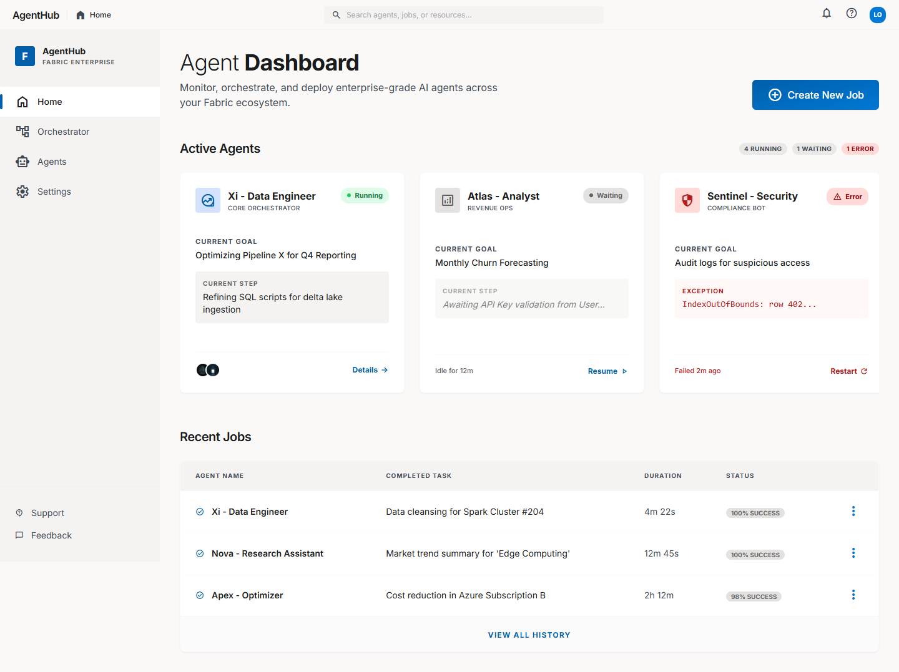
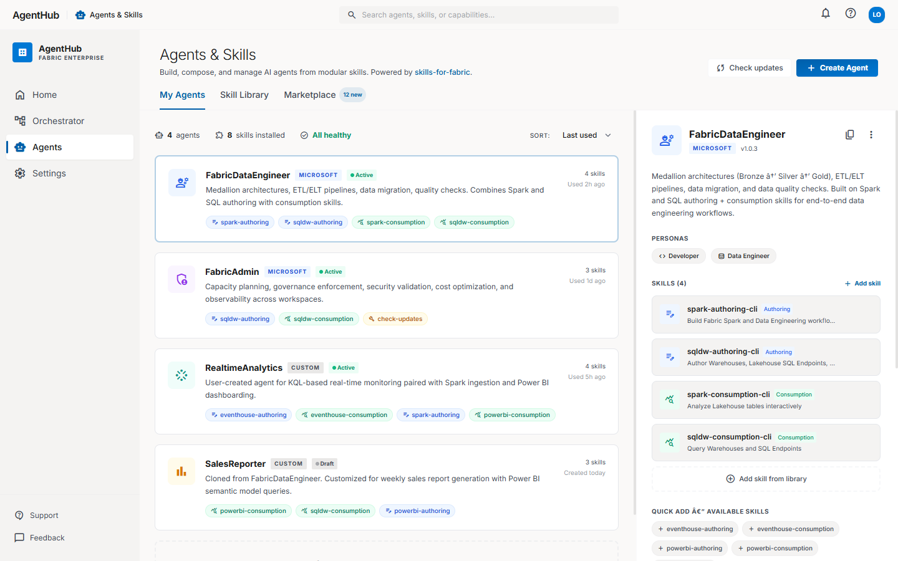
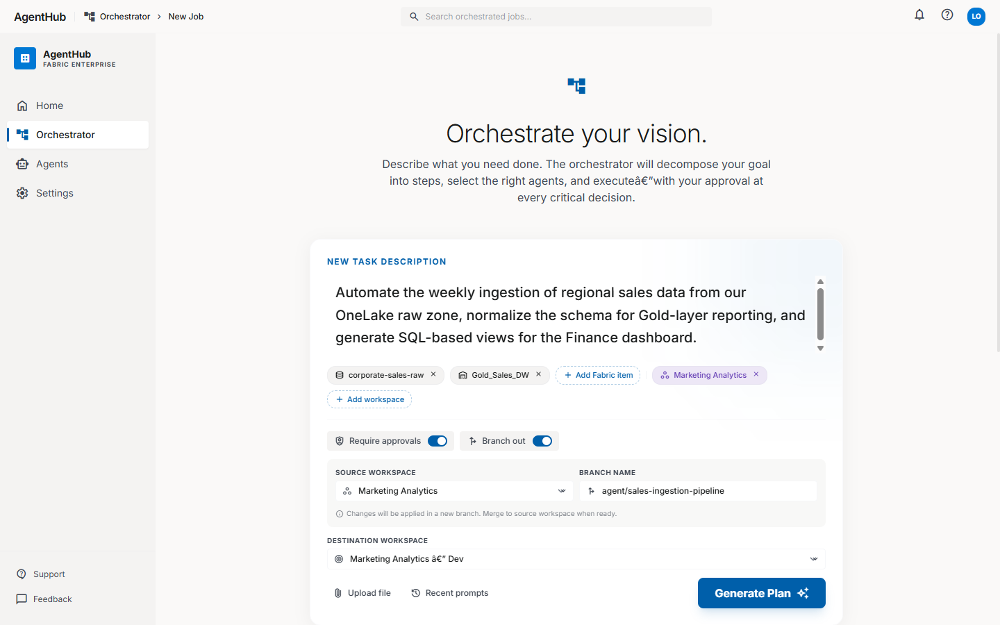
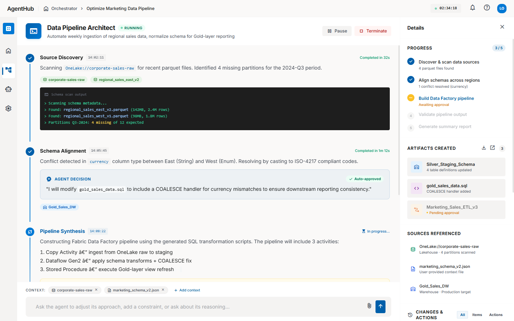
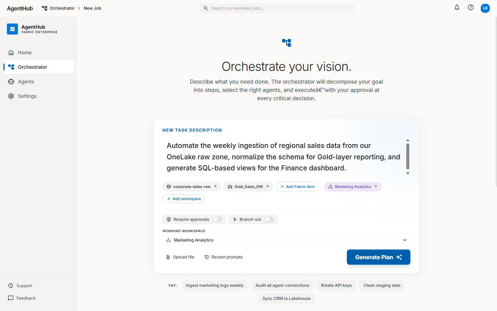

# Fabric AgentHub

**Enterprise AI Agent Orchestration Platform for Microsoft Fabric**

Fabric AgentHub is a UI design prototype for a next-generation platform that enables users to monitor, orchestrate, and deploy enterprise-grade AI agents across their Microsoft Fabric ecosystem. It introduces a skill-based composition model where agents are built from modular, reusable capabilities — powered by `skills-for-fabric`.

> **Status:** Design Phase — HTML/CSS prototypes with Tailwind CSS + Material Design 3

---

## Screenshots

### Home Dashboard
Monitor active agents, track job status, and view recent execution history at a glance.



### Agents & Skills Marketplace
Build, compose, and manage AI agents from modular skills. Browse Microsoft-provided and custom agents, inspect skill composition, and clone agents for customization.



### Orchestrator — Task Composer
Describe your goal in natural language. Attach Fabric items (Lakehouses, Warehouses) and workspaces as context. Configure branching and approval workflows before generating an execution plan.


### Orchestrator — Plan Review
Review the AI-generated execution plan before launching. Each step shows which Fabric items are touched, and approval gates are highlighted for critical operations like production pipeline deployments.



### Job Execution — Streaming Experience
Watch agents work in real time with streaming reasoning, code output, and agent decision cards. Human-in-the-loop approval prompts pause execution when production-impacting changes are proposed.



### Orchestrator — Fully Automatic Mode
When approvals and branching are disabled, the plan runs end-to-end without manual intervention. Ideal for trusted, repeatable workflows.



---

## Core Concepts

### Skill-Based Agent Composition

Agents are composed from modular **skills** — discrete capabilities that can be mixed and matched:

| Skill Type | Examples | Purpose |
|------------|----------|---------|
| **Authoring** | `spark-authoring`, `sqldw-authoring`, `eventhouse-authoring`, `powerbi-authoring` | Create and modify Fabric items (notebooks, SQL scripts, pipelines, reports) |
| **Consumption** | `spark-consumption`, `sqldw-consumption`, `eventhouse-consumption`, `powerbi-consumption` | Query and analyze data from Fabric endpoints |
| **Utility** | `check-updates` | Administrative and maintenance operations |

### Pre-Built Agents

| Agent | Provider | Skills | Description |
|-------|----------|--------|-------------|
| **FabricDataEngineer** | Microsoft | 4 | Medallion architectures (Bronze → Silver → Gold), ETL/ELT pipelines, data migration, quality checks |
| **FabricAdmin** | Microsoft | 3 | Capacity planning, governance enforcement, security validation, cost optimization, observability |
| **RealtimeAnalytics** | Custom | 4 | KQL-based real-time monitoring with Spark ingestion and Power BI dashboarding |
| **SalesReporter** | Custom | 3 | Weekly sales report generation with Power BI semantic model queries (cloned from FabricDataEngineer) |

### Orchestrator Workflow

The Orchestrator follows a 3-step workflow:

```
┌──────────────┐     ┌──────────────┐     ┌──────────────────┐
│  1. COMPOSE  │────▶│ 2. PLAN      │────▶│ 3. EXECUTE       │
│              │     │    REVIEW    │     │    (Streaming)   │
│ • NL prompt  │     │ • Step list  │     │ • Live reasoning │
│ • Fabric ctx │     │ • Agent map  │     │ • Code output    │
│ • Branch cfg │     │ • Approvals  │     │ • Approval gates │
│ • Approvals  │     │ • Edit plan  │     │ • Artifacts      │
└──────────────┘     └──────────────┘     └──────────────────┘
```

1. **Compose** — Describe your goal, attach Fabric items and workspaces as context, configure workspace branching and approval requirements
2. **Plan Review** — Review the AI-decomposed execution plan, edit steps, see which agents and Fabric items are involved, and identify approval gates
3. **Execute (Streaming)** — Watch the agent work step-by-step with streaming output, approve or reject production-impacting decisions via human-in-the-loop cards

---

## Key Features

### Human-in-the-Loop Approval System
- **Approval gates** for critical operations (e.g., deploying pipelines to production Gold layers)
- **Agent Decision cards** showing AI reasoning with auto-approval or manual review options
- **Modify Plan** and **Reject** controls alongside **Approve & Continue**

### Workspace Branching (Branch Out)
- Create isolated branches within Fabric workspaces for agent changes
- Configure source workspace, branch name, and destination workspace
- Merge back to production when changes are verified

### Fabric-Native Integration
- First-class support for **Lakehouses**, **Warehouses**, **Pipelines**, **Notebooks**, and **Reports**
- Color-coded Fabric item badges throughout the UI
- OneLake path scanning and schema profiling

### Real-Time Streaming Execution
- Step-by-step progress with timestamps and duration tracking
- Terminal-style code output blocks
- Typing cursor animation for active reasoning
- Artifact tracking (schemas, SQL files, pipelines) with direct workspace links

### Discovery & Recommendations
- AI-powered suggestions based on workspace activity (e.g., "Optimize Sales Pipeline", "Fix Schema Drift")
- Cost optimization insights (idle compute detection)
- Security audit recommendations
- Data lineage tracing for compliance

### Security & Responsible AI
- Azure AD authentication (no stored secrets/tokens)
- Prompt-injection safe design
- No arbitrary code execution
- Secret scanning
- OWASP LLM Top 10 compliance

---

## Design System

| Aspect | Implementation |
|--------|---------------|
| **Framework** | Tailwind CSS with custom theme |
| **Design Language** | Material Design 3 (M3) color system |
| **Icons** | Google Material Symbols (Outlined + Filled) |
| **Typography** | Inter (300–800 weights) |
| **Color Palette** | Microsoft Fluent-inspired primary (`#005faa` / `#0078d4`) |
| **Responsive** | Desktop-first with mobile bottom navigation shell |

---

## Repository Structure

```
fabric_agenthub/
├── README.md
├── Design/
│   ├── home_dashboard.html              # Home — Agent Dashboard with active agents & job history
│   ├── agent_marketplace.html           # Agents & Skills — composition, marketplace, detail panel
│   ├── orchestrator_step1_compose.html   # Orchestrator Step 1 — NL prompt with context & config
│   ├── orchestrator_step2_plan_review.html    # Step 2 — Plan review with approval gates
│   ├── orchestrator_step2_plan_review_b.html  # Step 2B — Plan review (no approvals, no branching)
│   └── job_execution_streaming.html      # Step 3 — Live streaming execution with HITL approvals
└── docs/
    └── screenshots/                      # UI screenshots for documentation
        ├── 01_home_dashboard.png
        ├── 02_agent_marketplace.png
        ├── 03_orchestrator_compose.png
        ├── 04_orchestrator_plan_review.png
        ├── 05_job_execution_streaming.png
        └── 06_orchestrator_no_approvals.png
```

---

## Getting Started

The prototypes are standalone HTML files — no build step required.

```bash
# Clone the repo
git clone https://github.com/LukaszObst/fabric_agenthub.git
cd fabric_agenthub

# Serve locally (any static file server works)
npx http-server -p 3000

# Open in browser
# http://localhost:3000/Design/home_dashboard.html
```

### Running the AgentHub stack locally (Docker)

The full backend + frontend + Fabric DevGateway runs via `docker compose`:

```bash
cd AgentHub
cp .env.example .env      # fill in tenant, app, workspace IDs
./start.sh
```

#### Platform notes

The `dev-gateway` container is pinned to `linux/amd64` because Microsoft
distributes the Fabric DevGateway binary as x64-only. This is transparent
on Intel/AMD64 hosts. **On ARM64 hosts (Apple Silicon, Snapdragon, etc.)
register QEMU emulation once:**

```bash
docker run --privileged --rm tonistiigi/binfmt --install amd64
```

The setting persists across reboots, so this is a one-shot.

#### Corporate VPN networking

If your VPN advertises all RFC1918 ranges (common with Zscaler /
GlobalProtect), Docker may fail to allocate a bridge subnet
(*"all predefined address pools have been fully subnetted"*). Fix by
pinning Docker to the IANA benchmarking range, which no VPN routes:

```bash
sudo tee /etc/docker/daemon.json > /dev/null <<'EOF'
{
  "bip": "198.18.255.1/24",
  "default-address-pools": [
    { "base": "198.18.0.0/16", "size": 24 }
  ]
}
EOF
sudo service docker restart
```

---

## Navigation Map

| Page | URL Path | Description |
|------|----------|-------------|
| Home Dashboard | `/Design/home_dashboard.html` | Active agents overview, job history |
| Agents & Skills | `/Design/agent_marketplace.html` | Agent list, skill composition, detail panel |
| Orchestrator — Compose | `/Design/orchestrator_step1_compose.html` | New job creation with NL prompt |
| Plan Review (with approvals) | `/Design/orchestrator_step2_plan_review.html` | Execution plan with approval gates |
| Plan Review (automatic) | `/Design/orchestrator_step2_plan_review_b.html` | Fully automatic execution plan |
| Job Execution | `/Design/job_execution_streaming.html` | Live streaming execution view |

---

## Example Workflow

**Scenario:** *"Automate the weekly ingestion of regional sales data from our OneLake raw zone, normalize the schema for Gold-layer reporting, and generate SQL-based views for the Finance dashboard."*

1. **Compose** — Enter the goal, attach `corporate-sales-raw` (Lakehouse) and `Gold_Sales_DW` (Warehouse) as context, select `Marketing Analytics` workspace, enable branching to `agent/sales-ingestion-pipeline`
2. **Plan Review** — Review the 5-step plan: Discover Sources → Resolve Schema → Create Pipeline (approval required) → Validate → Generate Report
3. **Execute** — Watch the agent scan OneLake, detect schema conflicts, propose a COALESCE handler, and request approval before deploying `Marketing_Sales_ETL_v3` to production

---

## Contributing

This project is in the **design phase**. Contributions welcome for:

- Additional page designs (Settings, individual Agent Detail, Marketplace browse)
- Backend architecture proposals
- Fabric REST API integration patterns
- Accessibility improvements

---

## License

This project is proprietary. All rights reserved.
